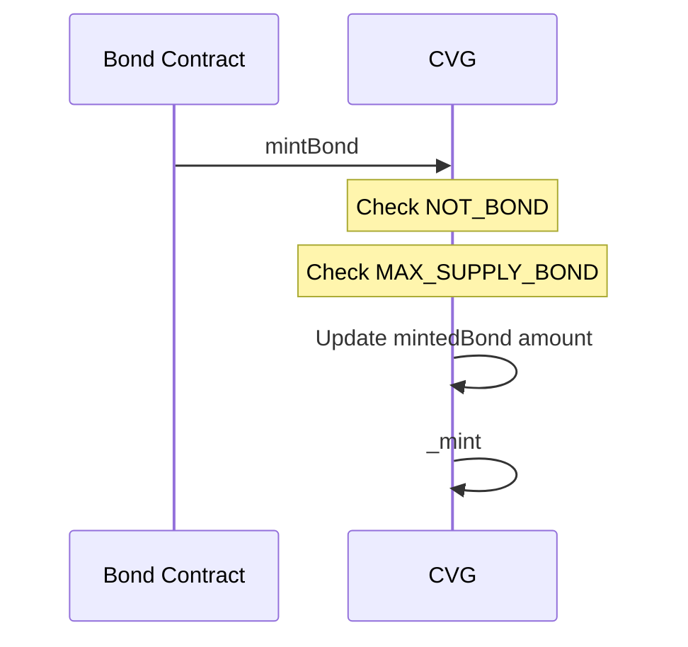
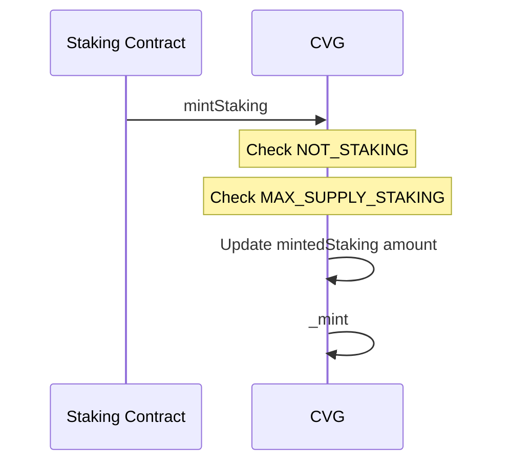
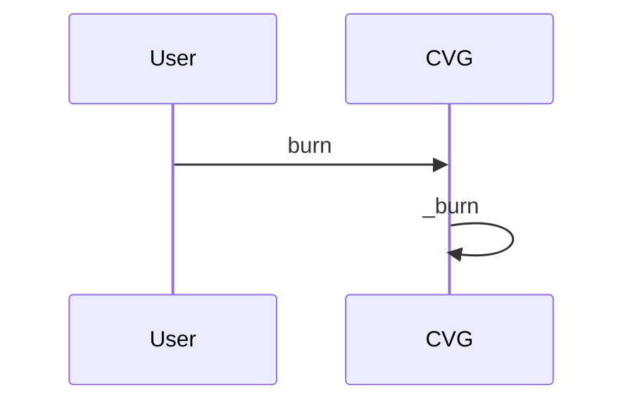

# CVG - Convergence Token

## Description

The Convergence token follows the ERC-20 protocol standards.
This is a mintable token with a maximum supply of `150.000.000` tokens with a distribution divided into four categories:

- Airdrop (`1.500.000` tokens)
- Vesting supply (`40.500.000` tokens)
- Bonds supply (`45.000.000` tokens)
- Staking supply (`63.000.000` tokens)

When deployed, the total vesting and airdrop supply will automatically be minted to the corresponding address of both the vesting and airdrop contracts.
The burning system implemented on this token leads to the total supply being reduced and therefore the maximum supply.

### mintBond

Bond contracts are the only contracts that can mint $CVG tokens with this function.
A maximum of `45.000.000` tokens can be minted by this process.

### mintStaking

Only staking contracts can call this function to mint $CVG tokens to users that claim their rewards from a `SdtStakingService` contract.
A maximum of `63.000.000` tokens can be minted by this process.

### burn

Anyone can burn his $CVG tokens.

