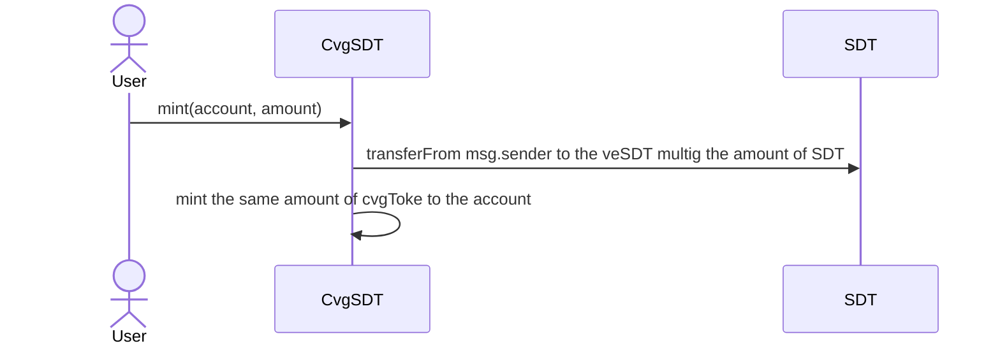
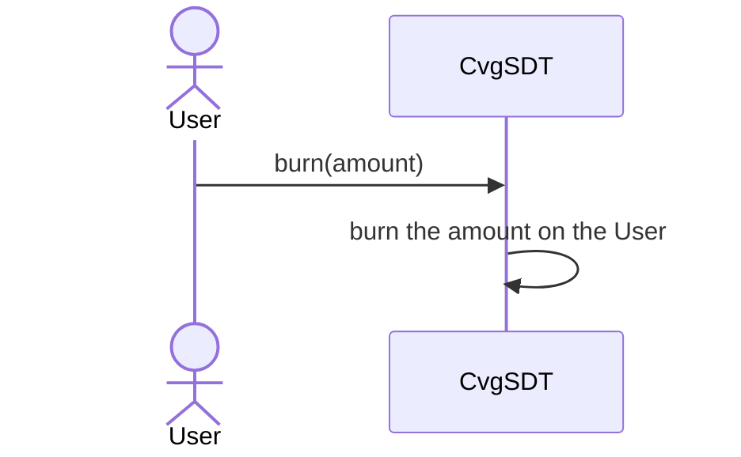

# CvgSdt

## Description

The CvgSdt token follows the ERC-20 protocol standards.
It's a liquid locker of the veSDT token, which means that having 1 CvgSDT is the same as having 1veSDT. The advantage of a liquid locker is that it's exchangeable, conversely to the ve token which is not.

An associated stable pool will allow stakers to retrieve their $SDT tokens at almost 1:1 ratio depending on the peg of the pool.

### mint

### burn

