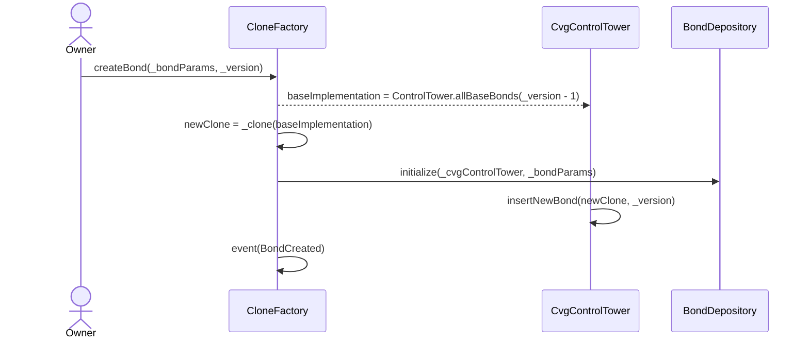
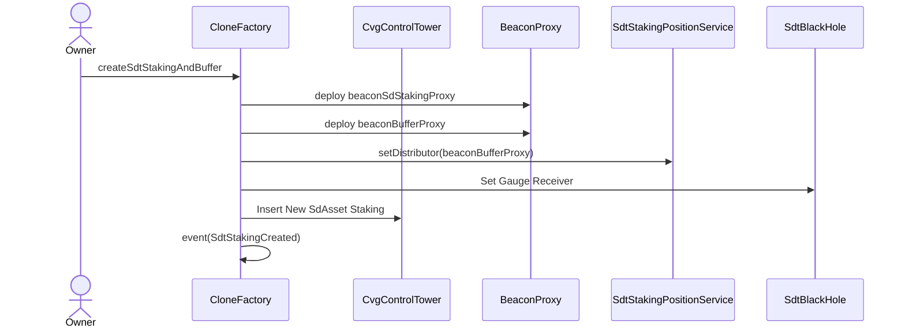

## Contract: CloneFactory

### Description

The `CloneFactory` contract serves as a factory for creating cloned instances of other contracts using minimal proxy and Beacon Proxy implementations.
It allows the creation of bonds and sd/LP-AssetStaking contracts.

### State Variables

1. `cvgControlTower`: Address of the CVG Control Tower contract.
2. `beaconSdStaking`: Address of the beacon for the sdAsset staking contract.
3. `beaconBuffer`: Address of the beacon for the buffer contract.
4. `withdrawCallInfo`: Withdraw call information structure.

### Events

1. `BondCreated`: Emitted when a new bond is created.

   - Parameters:
     - `base`: Address of the base bond contract.
     - `clone`: Address of the cloned bond contract.
     - `bondParams`: Bond parameters.

2. `SdtStakingCreated`: Emitted when a new sdt staking contract is created.
   - Parameters:
     - `stakingClone`: Address of the cloned staking contract.
     - `gaugeAsset`: Address of the gauge asset.
     - `bufferClone`: Address of the buffer contract.

### Constructor

The constructor is used for contract deployment and initializes the contract.

### Functions

1. `initialize(ICvgControlTower _cvgControlTower) external initializer`: Initializes the contract with the CVG Control Tower address. This function can be called only at deployment.

2. `createBond(IBondStruct.BondParams calldata _bondParams, uint256 _version) external onlyOwner`: Creates a new bond through minimal proxy implementation.

   - Parameters:
     - `_bondParams`: Bond parameters.
     - `_version`: Version of the base bond to clone.

3. `createSdtStakingAndBuffer(address _sdAssetGauge, string memory _symbol) external onlyOwner`: Creates a new sd/LP-Asset staking contract and its associated buffer contract through minimal proxy implementation.

   - Parameters:
     - `_sdAssetGauge`: Address of the gaugeToken.
     - `_symbol`: Symbol of the token.

4. `setBeaconSdStaking(address _beaconSdStaking) external onlyOwner`: Sets the address of the beacon for the sdAsset staking contract. Only the owner can call this function.

5. `setBeaconBuffer(address _beaconBuffer) external onlyOwner`: Sets the address of the beacon for the buffer contract. Only the owner can call this function.

6. `setWithdrawCallInfo(WithdrawCallInfo calldata _withdrawCallInfo) external onlyOwner`: Sets the withdrawal call information. Only the owner can call this function.

7. `_clone(address newImplementation) internal returns (address instance)`: Internal function to deploy and return the address of a clone of a contract.

### Function Diagrams

1. `createBond`

2. `createSdtStakingAndBuffer`

