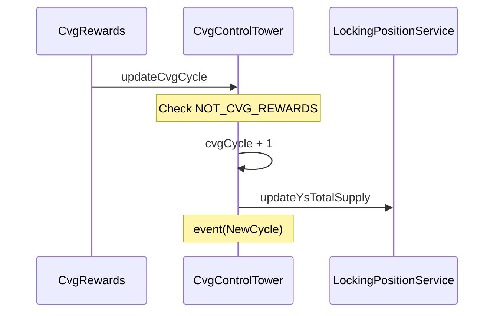
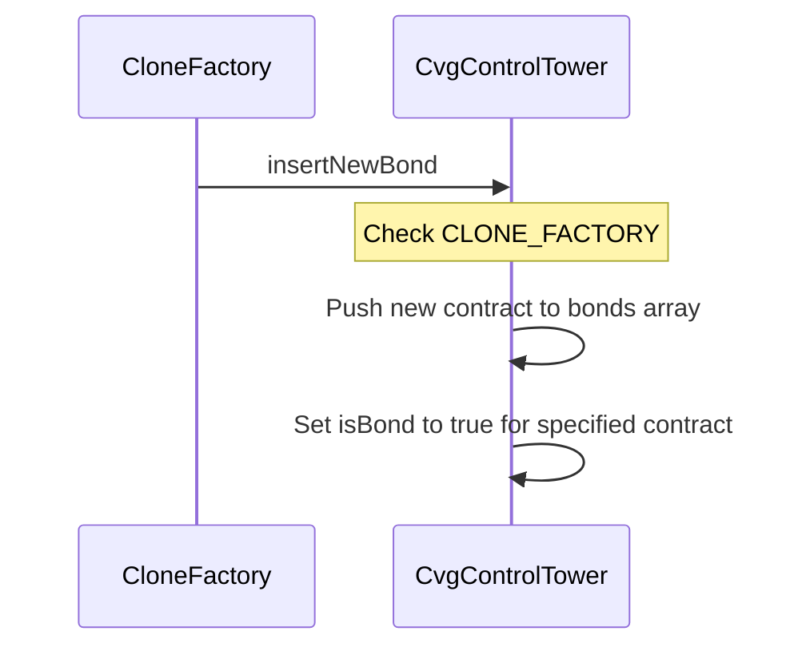
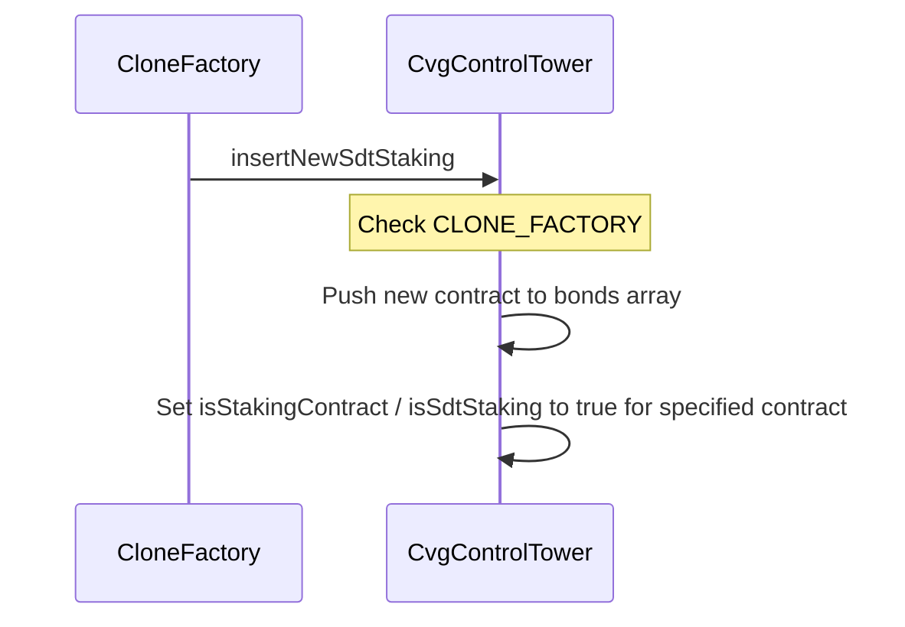
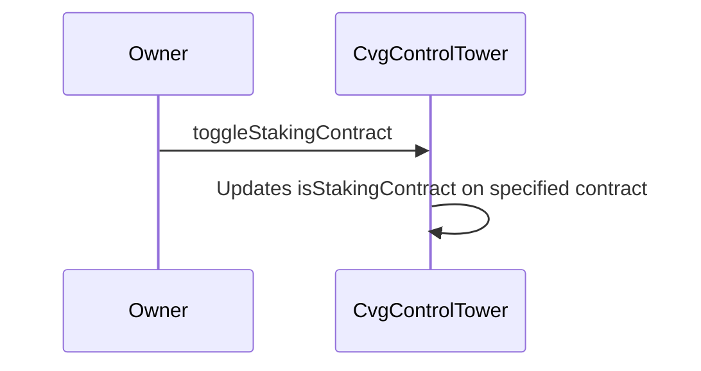

# CvgControlTower

## Description

This contract aims to be the heart of Convergence. Every other contract deployed by us will take data from it.
It contains all the needed information for the protocol to run smoothly: staking data, locking data and more...

This is an upgradeable contract, so we have the ability to implement new data and functionalities in the future in case we would like to upgrade to a V2.

## updateCvgCycle

The Cvg cycle is stored globally in the CvgControlTower and is retrieved in multiple contracts of the protocol (staking, locking, ysDistributor, ...).
Each cycle corresponds to approximately one week and can be manually triggered by the `CvgRewards` contract when 7 days are passed since last update.
When a cycle is incremented, the `LockingPositionService` will update the ysCvg total supply according to the checkpoints that were executed during the cycle that has just ended.

## insertNewBond

When a new bond contract is created through the `CloneFactory`, this function is called by the `CvgControlTower` to update some relative data to this newly created bond contract.
The address of this new contract is added to the array containing all the other bond contracts. It is using the minimal proxy pattern.

## insertNewSdtStaking

When a new `SdtStakingService` contract is created through the `CloneFactory`, this function is called by the `CvgControlTower` to update some relative data to this newly created staking contract.
The address of this new contract is added to the array containing all the other staking contracts and `SdtStakingService`contracts. It is using the beacon proxy pattern.

## toggleStakingContract

Convergence has the ability to enable or disable any staking contract in case of a potential emergency issue.

