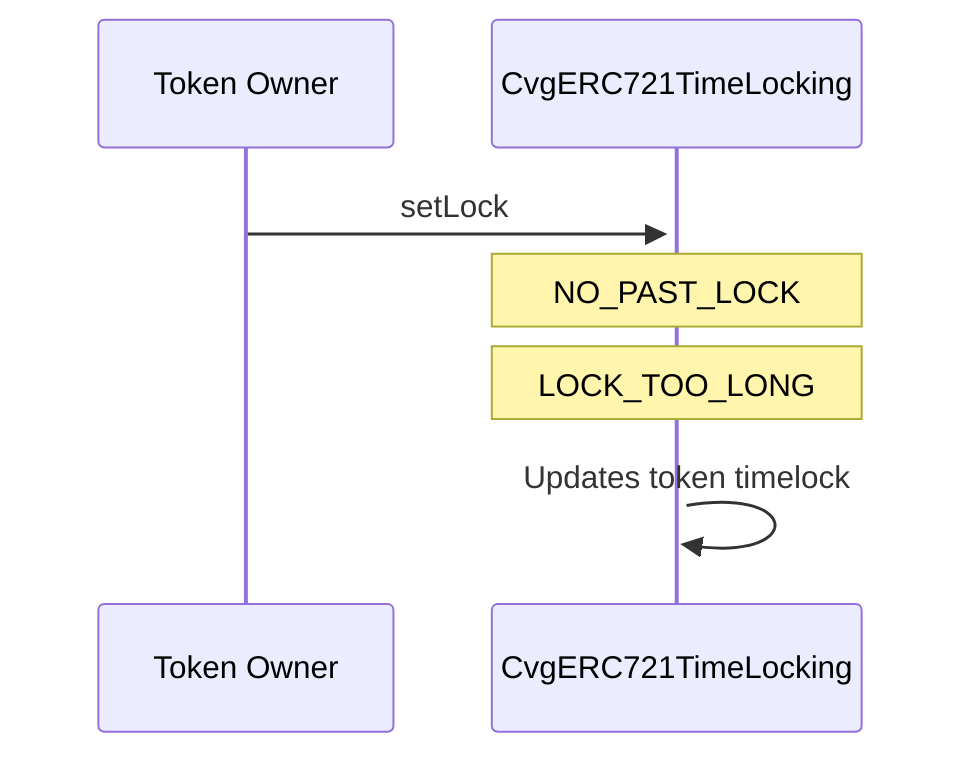

# CvgERC721TimeLocking

## Description

This implementation is a layer above the ERC-721 protocol which aims to put a timelock on an NFT by its owner.
It is used in several parts of Convergence to protect potential buyers from being front-runned by malicious token sellers.

The common use case is when a user decides to sell its token involving a staking position with rewards equivalent to `$100.000` at a price of 40 ETH on OpenSea.
When a buyer comes in and make the purchase, the seller can front-run the buyer and claim the rewards related to its token just before the sale happens if there's no timelock on this token.
At the end, the seller gets 40 ETH and the `$100.000` corresponding to the claimed rewards amount. The buyer gets a NFT with no rewards and lost 40 ETH.

### setLock

