# CvgOracle

## Description

This contract allows to compute prices of the assets proposed through the Bond program in USD$.

`CvgOracle` contract ensures that asset price found in Liquid Pool is not too distant from the aggregatorOracle price.

To check that, this contract will retrieve the current price based on the pool type (Univ2 or Univ3, or Curve) and then compare that to the latest aggregatorOracle price with a delta parameter (in %) set by the team.
The price verification acts in two-way depending on the pool type:
- Firstly, we fetch the **execution** price
  - If pool is from Uniswap V2, we are fetching the price from the reserves
  - If pool is from Uniswap V3, we are fetching the time weighted average price (TWAP)
  - If pool is from Curve, we simply are fetching the oracle price from the provided method `price_oracle` on the pool contract
- Then, we fetch the **limit** price
  - If pool is from Uniswap (V2 or V3), we are fetching the price from the associated ChainLink aggregator
  - If pool is from Curve, we simply are fetching the last price of the pool thanks to the provided method `last_price` on the pool contract

Thanks to these two prices, we are calculating the limits (delta) that the **execution** price must not exceed.
This kind of check will secure the protocol from possible arbitrary liquidity attacks.

## Example of Liquidity Attack

- An attacker has a balance of 10M$ of $CRV (or with a flash loan)
- Our oracle targets the Curve liquidity pool (LP) CRV / USDT which is potentially not very liquid (let's say around 10M$)
- The attacker can, in one transaction:
  - Sells his $CRV in the liquidity pool, which brings the price of $CRV down by around 30% (as an example)
  - Buy all the $CRV bonds on Convergence at a 30% discount
  - Makes a swap in the other way to restore $CRV price

This attack is not feasible in our case, as the `price_oracle` will always be the `last_price` before the transaction happens.
This means that during the price fetching, `last_price` is less than 30% of the `price_oracle`.
With the `deltaLimitOracle` parameter lower than 30%, the transaction would fail.

### _getV2Price

Get the price of an asset through an Uniswap V2 pool.

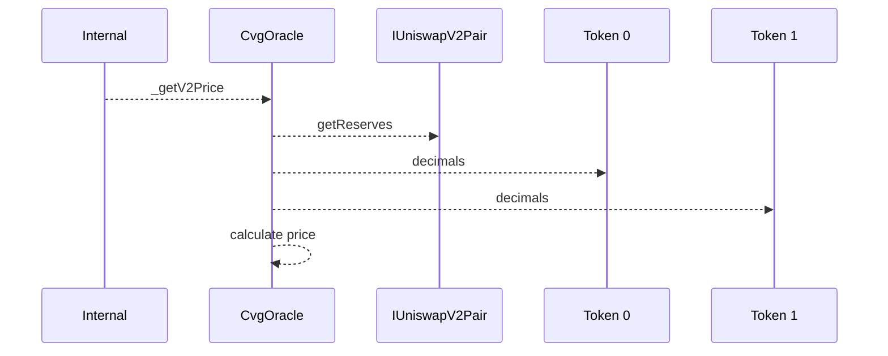

### _getV3Price

Get the price of an asset through an Uniswap V3 pool.

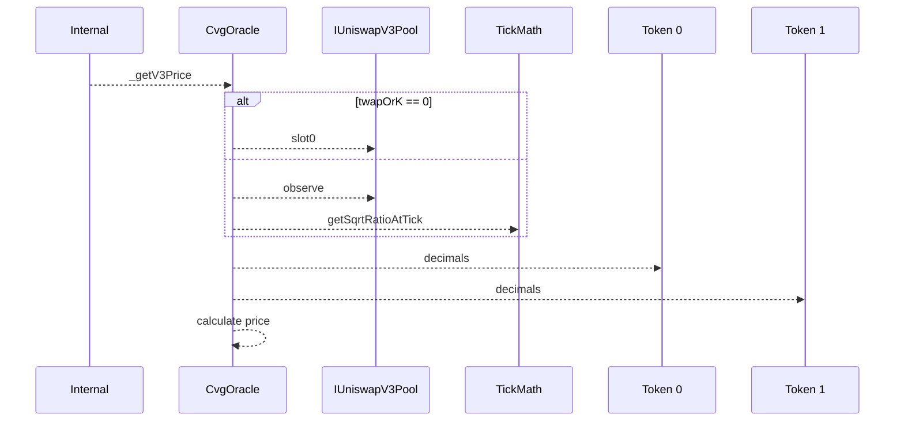

### _getCurveLastPrice

Get the price of an asset through a Curve pool.

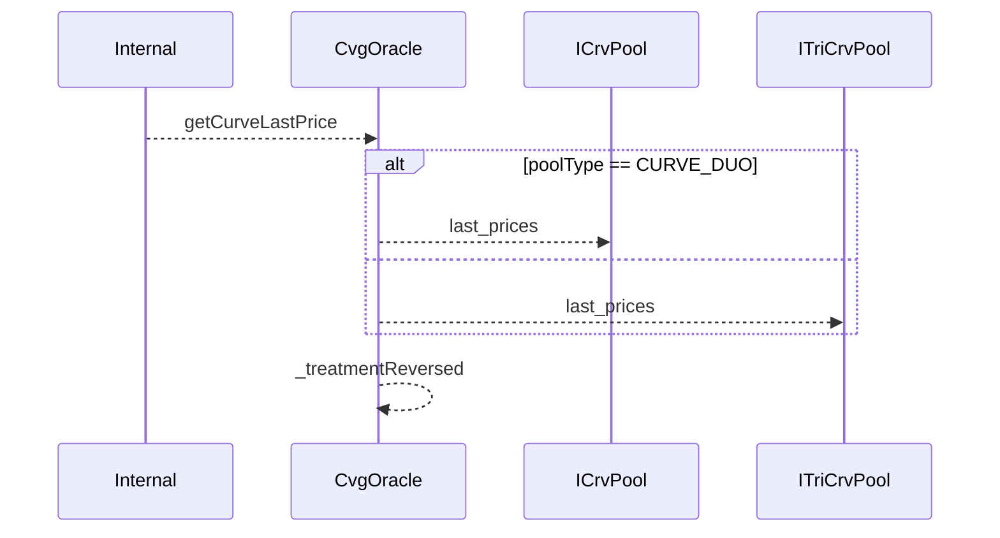

### _getPriceOracle

Get the price of an asset thanks to the provided oracle parameters.

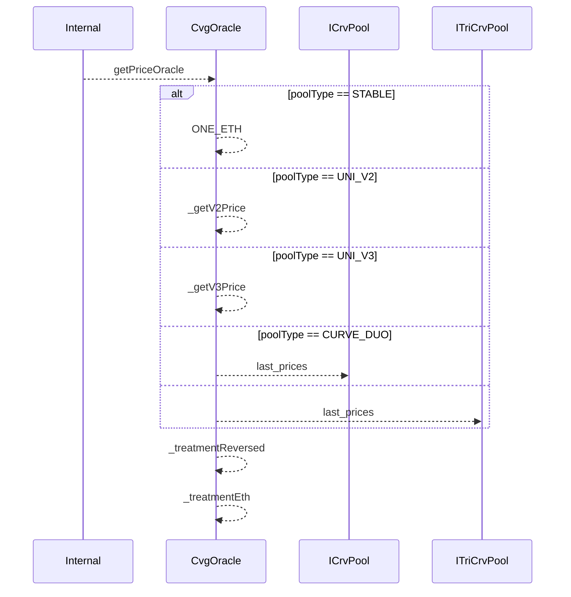

### _getDataForVerification

Get data used for price verification for a provided ERC20 token.

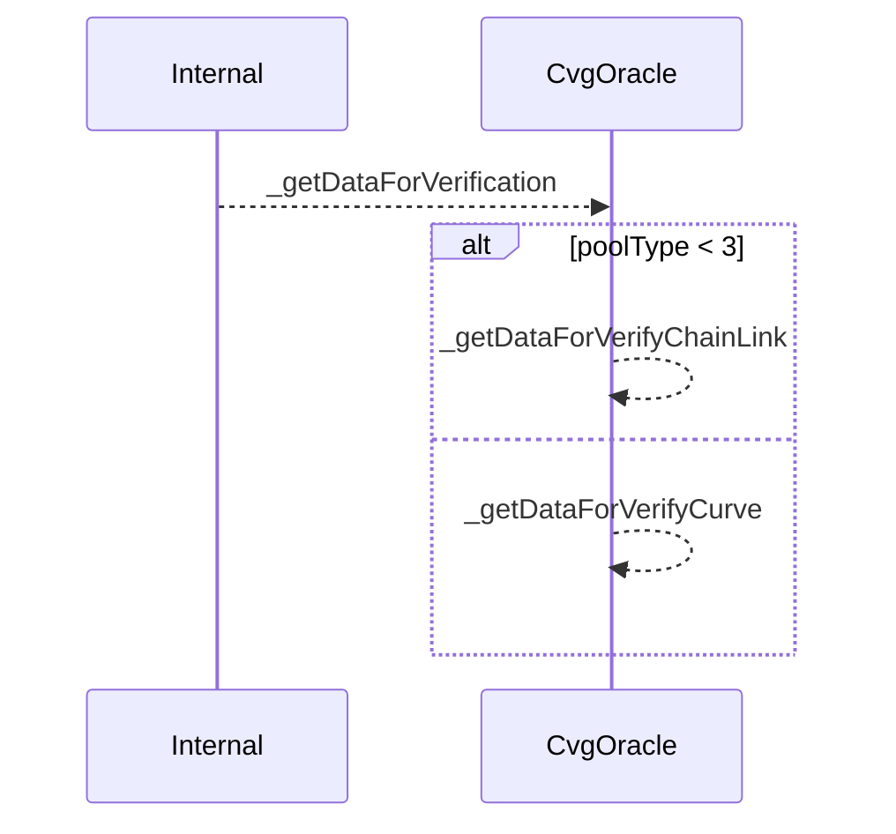

### getAndVerifyTwoPrices

Get the price of two tokens in USD under 18 decimals.

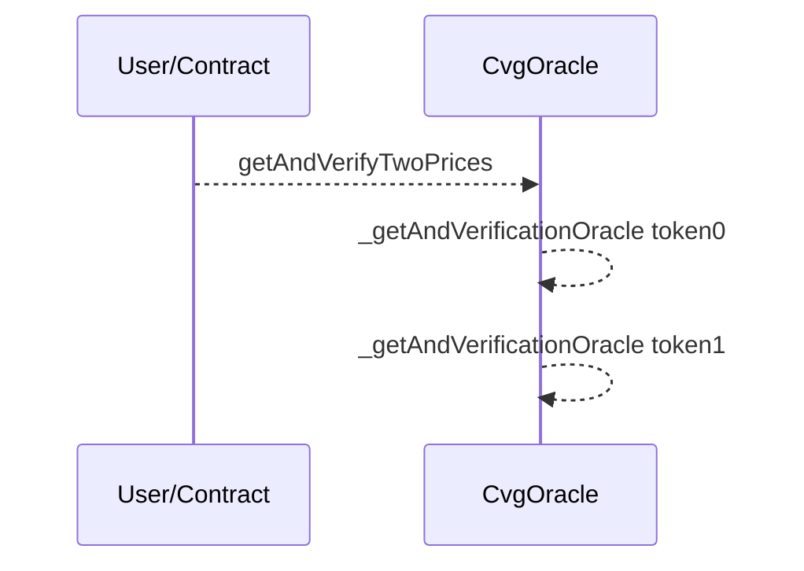

### getEthPriceOracleUnverified

Get the price of ETH without additional verification on it.

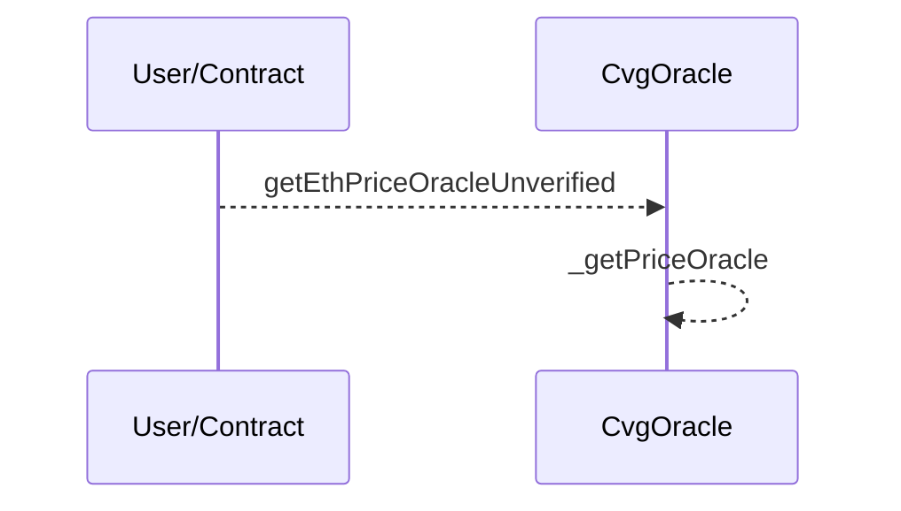

### getCvgPriceOracleUnverified

Get the price of CVG without additional verification on it.

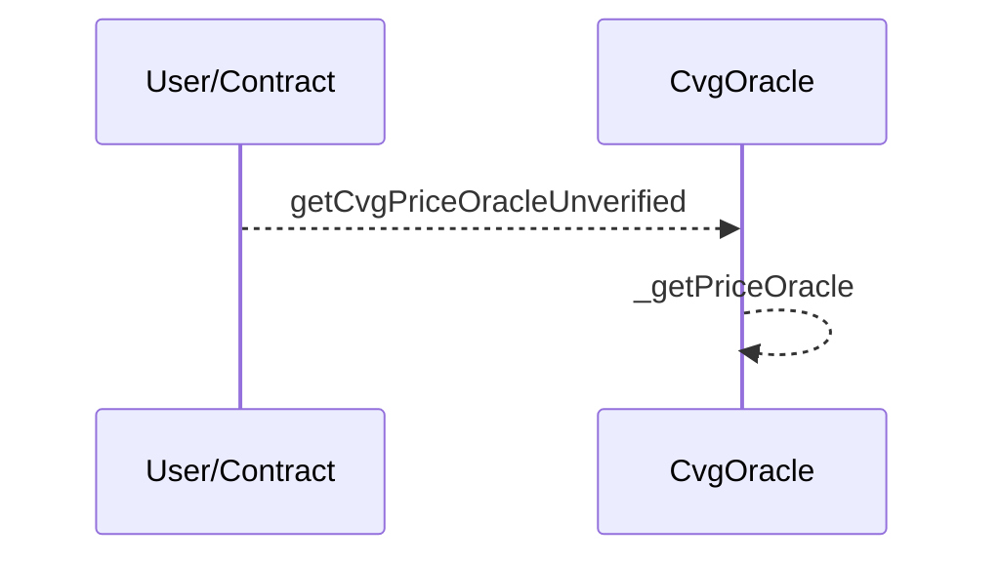

### getPriceOracleUnverified

Get the price of an ERC20 token without additional verification on it.

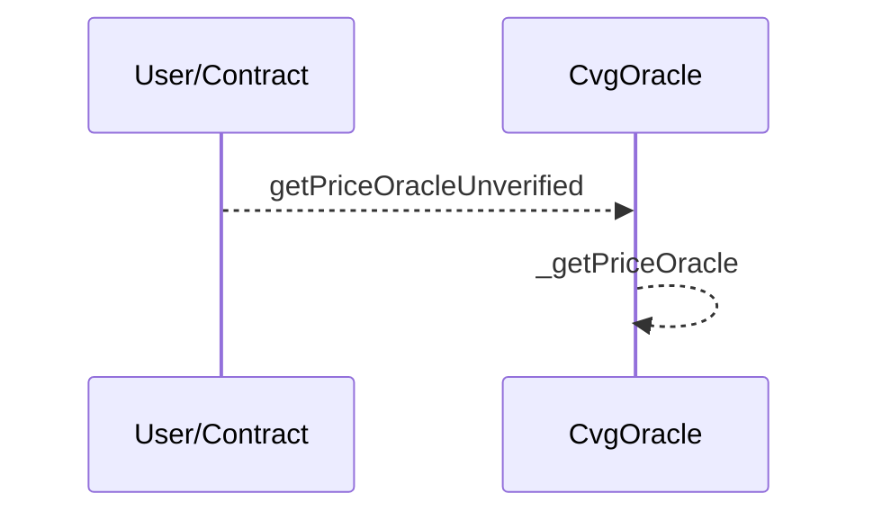

### _getAndVerificationOracle

Get the price of an asset thanks to the provided oracle parameters with proper requirements.

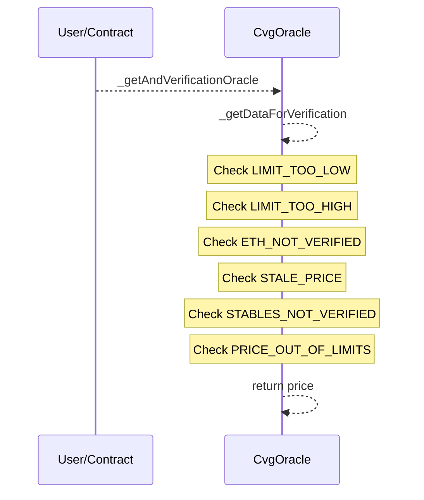

### _verifyStableInPath

Verify that stables price are valid and don't exceed allowed delta.

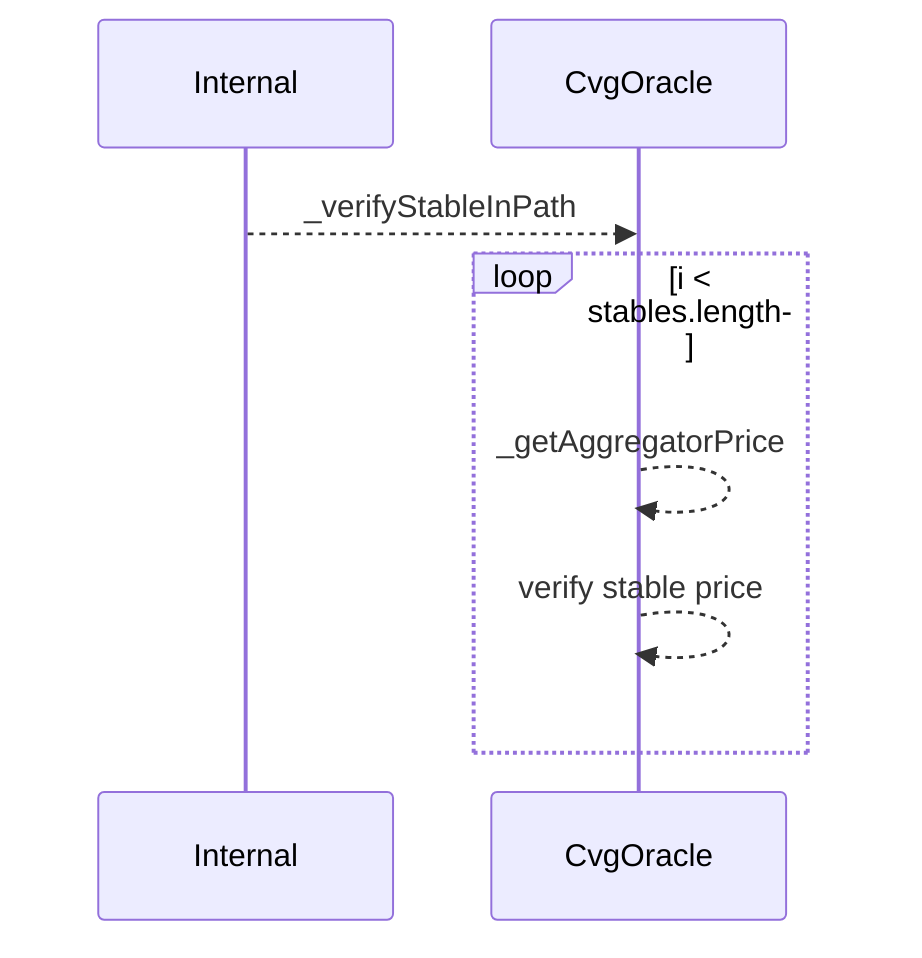

### _getDataForVerifyChainLink

Get data used for later verification through ChainLink.

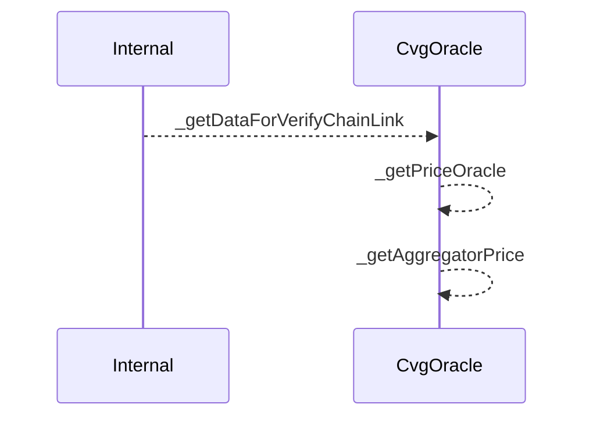

### _getDataForVerifyCurve

Get data used for later verification through Curve.

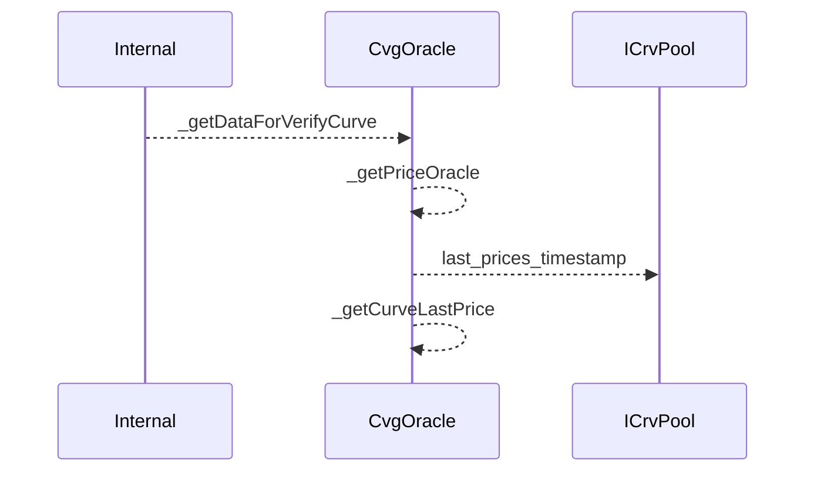

### _treatmentEth

This function allows to align all prices computed by the Oracle to 18 decimals, whatever the number of decimals of the token and the way Uniswap or Curve compute the price.
Also, if the price computation passes through a pool that involves ETH and not a stablecoin, we return a boolean that is the result of the price verification between `CvgOracle` & ChainLinkAggregator (for Uniswap pools) or the last price (for Curve pools).

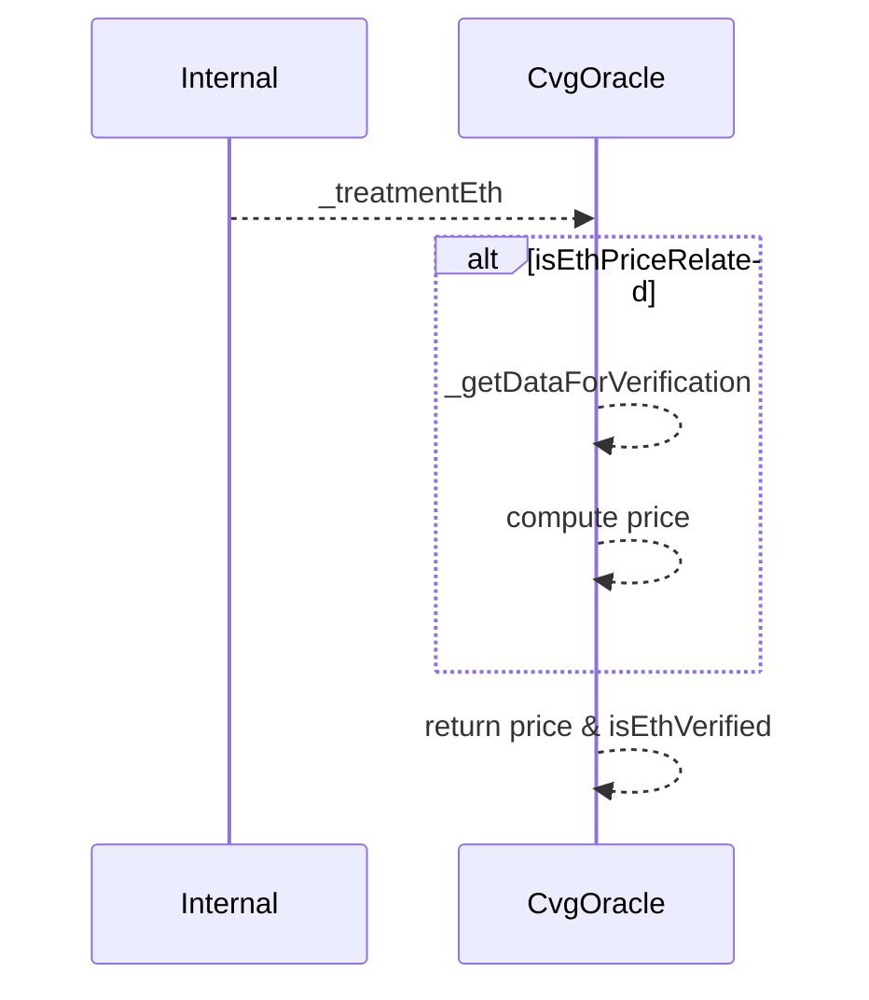

### _getAggregatorPrice

Get the token price from the ChainLink aggregator.

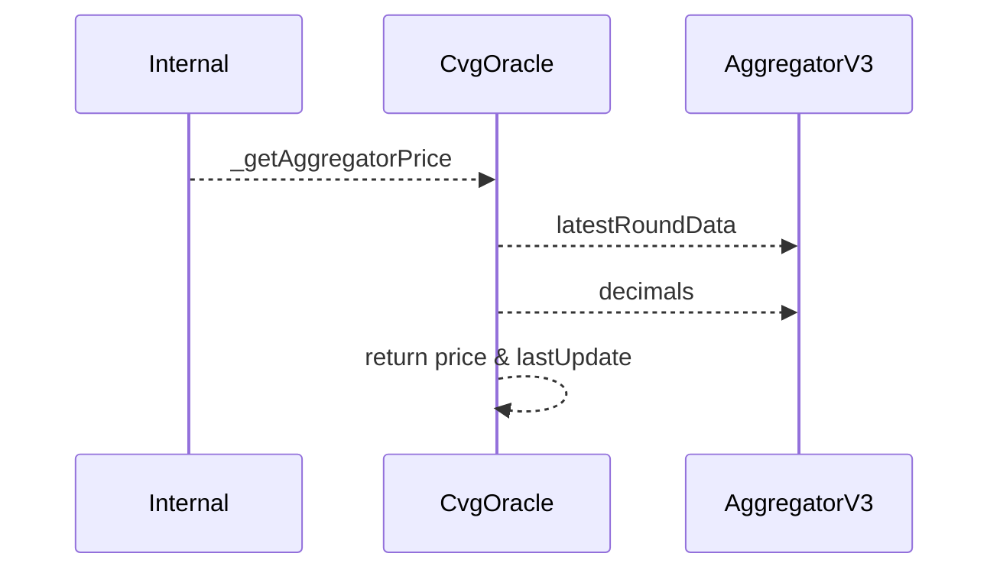