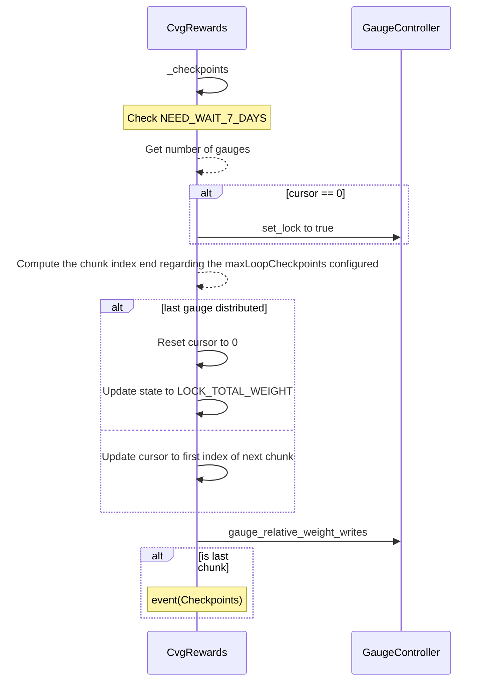
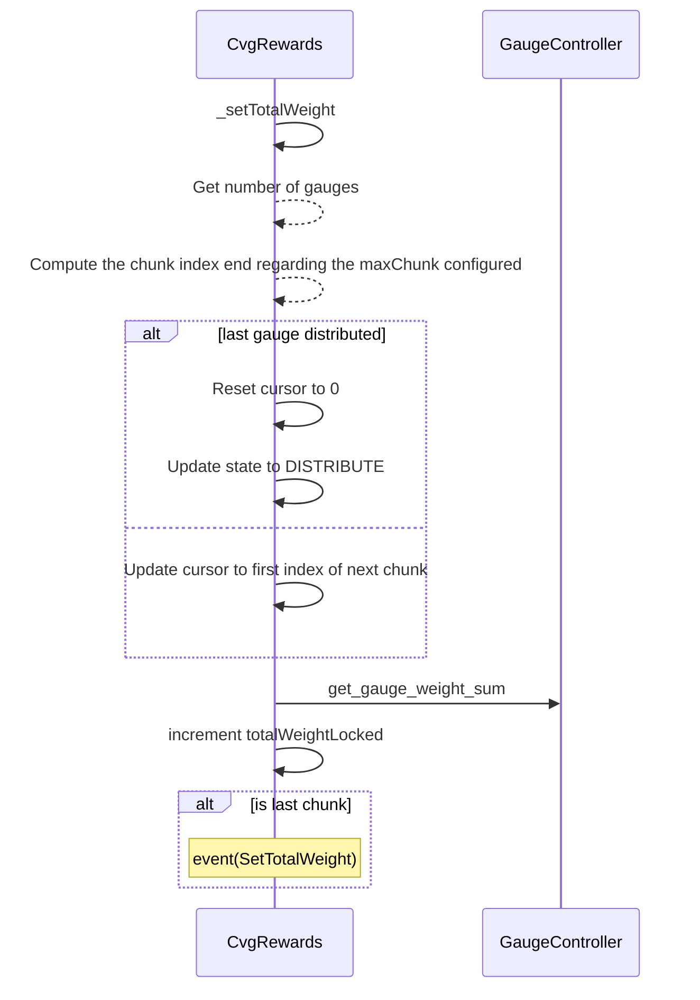
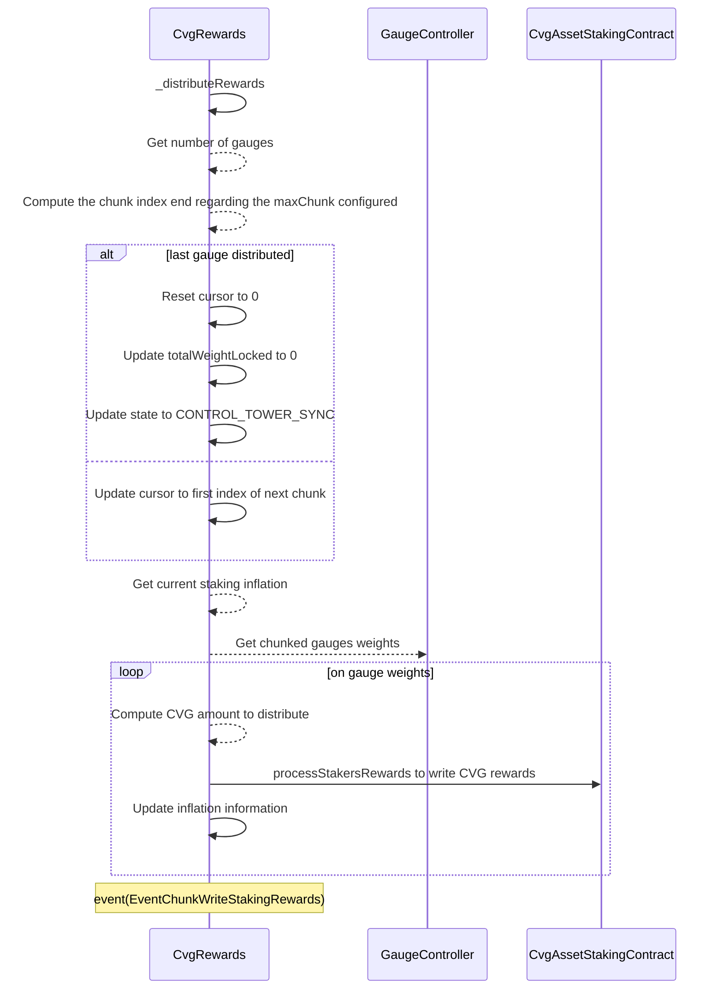
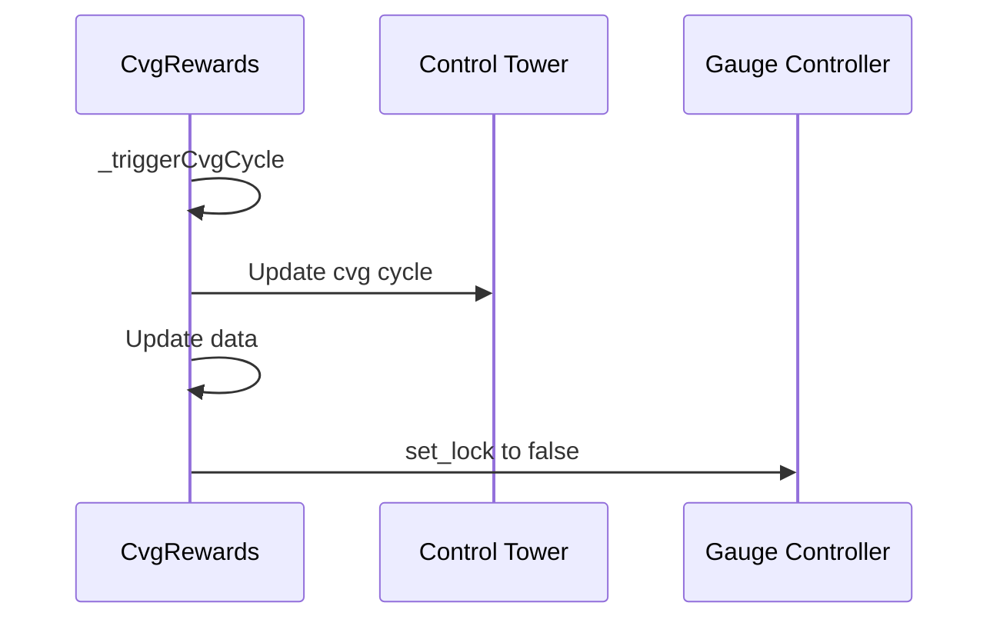

# CvgRewards

## Global description

`CvgRewards` contract distributes the 63M inflation of $CVG tokens.
The distribution of $CVG occurs at the end of each Cvg cycle, every 7 days minimum.
Each cvg cycle, an amount of `167,123.46` $CVG tokens is emitted during the first 105 cycles. After that, the emission is reduced by square root of 2 (approx. 1.4142) every 105 cycles until cycle 1561 where emission will stagnate at `923.2354137` $CVG tokens.

Each staking contract is linked to a Gauge in the `GaugeController`. Anyone with some `veCvg` in an NFT from `LockingPositionService` can vote on a gauge to increase the total amount distributed to Stakers of staking contracts.

To compute the amount received by a gauge / Staking contract, we compute the ratio between the **totalGaugeWeight** and the weight of the gauge from the `GaugeController`.
This contract:

`CvgRewards` contract is designed to have 4 states:

- **CHECKPOINT**: Used when claiming a Cvg cycle, iterate through all staking contracts and checkpoint gauge weight in the `GaugeController`. Needed to actualize all gauge weights.
    At the beginning of the process, votes are locked to prevent new votes on gauge to happen during the process which could lead to calculation errors.
- **LOCK_TOTAL_WEIGHT**: Iterates through all staking contracts gauges weight (in several chunks if needed) and sum them to obtain and lock the total gauge weight for the **DISTRIBUTE** step.
    This process is mandatory to skip killed gauges in the calculation and therefore to have an incorrect total value. 
- **DISTRIBUTE**: Writes $CVG inflation in contracts proportionally with the total weight locked in **LOCK_TOTAL_WEIGHT** step and gauge weight associated to the Staking contract.
- **CONTROL_TOWER_SYNC**: Updates the CVG cycle and unlock gauge votes

Internal functions _checkpoints_ & _setTotalWeight_ & _distributeRewards_ are designed on a chunking pattern. This is called the state machine pattern.
Indeed, in order to be able to scale in number of gauges infinitely and prevent the OOG (Out Of Gas), the distribution may be triggered in several transactions. To do this, we need to:

- _set_lock_ on the `GaugeController` to true, in order that users don't change their votes between several transactions during the process
- use a **cursor** storage value that is incremented for each chunk of N gauges, N being a parameter that the contract owner can modify

## Function details

### <u>Checkpoint step</u>

Actualize all staking contract gauge weights by chunks regarding **maxChunkCheckpoint** in **cvgRewardsConfig**.
This is done by calling the function **gauge_relative_weight_writes** in the `GaugeController` updating the weight of all chunkGauges.

Updates:

- **state** to **LOCK_TOTAL_WEIGHT** if the end of the gauge array is reached.
- **cursor** to zero or to the next chunk starting index.

### <u>Set Total Weight</u>

Store total gauge weight by incrementing **totalWeightLocked** at each chunks regarding **maxLoopSetTotalWeight** in **cvgRewardsConfig**.
This function is looping over gauge chunks to retrieve their weight because the `GaugeController` contract wasn't designed to read the weight of killed gauges.

Updates:

- **state** to **DISTRIBUTE** if the end of the gauge array is reached.
- **cursor** to zero or to the next chunk starting index.

### <u>Distribute Cvg Rewards</u>

Writes $CVG to all Staking contracts through **processStakersRewards**
Chunks are sized by **maxChunkDistribute** in **cvgRewardsConfig**.

Updates:

- **totalWeightLocked** that will be used in the next **DISTRIBUTE** step.
- **state** to **CONTROL_TOWER_SYNC** if the end of the gauge array is reached.
- **cursor** to zero or to the start index of the next chunk

### <u>Trigger Cvg Cycle</u>

Trigger the Cvg cycle update and unlock gauge votes.

Updates:

- **state** to **CHECKPOINT**
- **lastUpdatedTimestamp** to current block timestamp
- **cvgCycleRewards** to be incremented by 1

