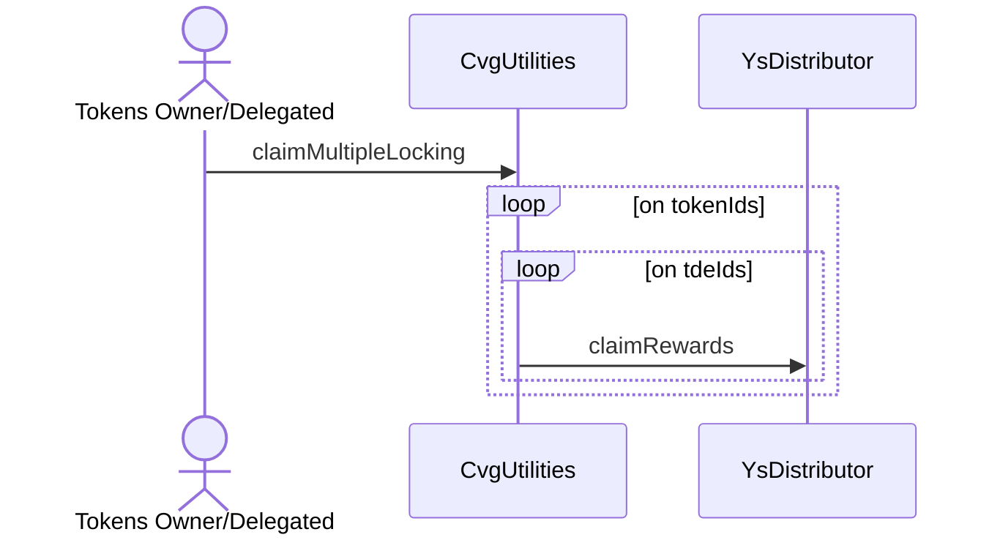
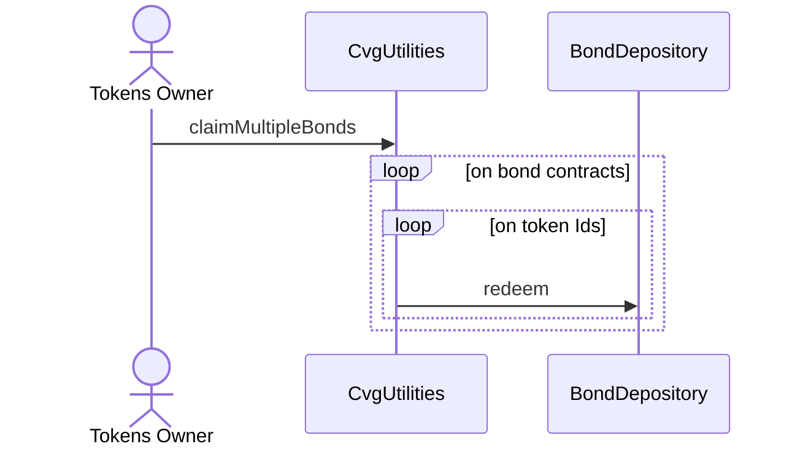
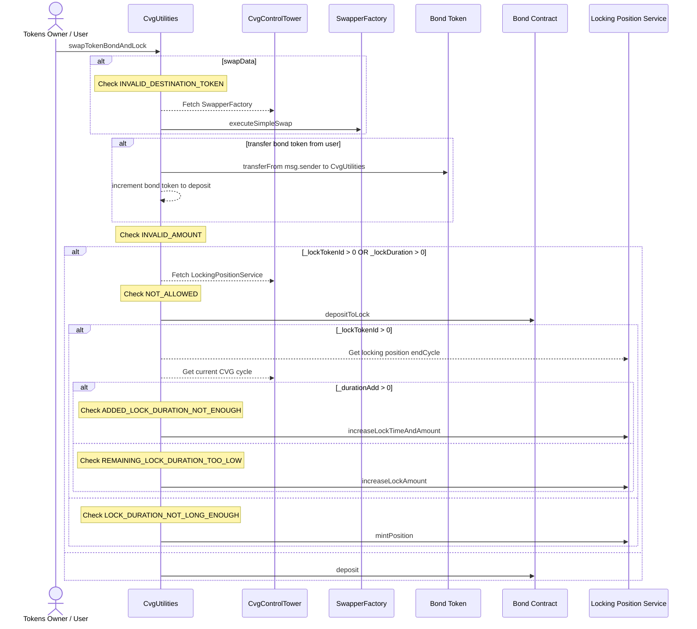
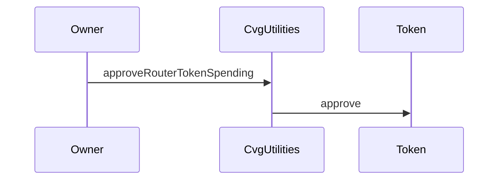

# CvgUtilities

## Global description

`CvgUtilities` is a contract allowing to improve the user experience by reducing the number of transactions:

- Claims on `YsDistributor` for several NFT owned or delegated on several TDE cycle.
- Claims on several `BondDepository` on multiple NFT owned.
- Creates a bond or locking position starting with common ERC20 tokens (WETH / DAI / etc.)

## Function details

### claimMultipleLocking

Allows to claim several TDE cycles on multiple tokenIds from `LockingPositionService` owned or delegated.

### claimMultipleBonds

Allows to redeem in one transaction several tokenIds from several `BondDepository`.

### swapTokenBondAndLock

Allows in one transaction to:

- Buy bond contract's token through `1INCH`
- Transfer additional bond tokens from user
- Mint or update a locking position with these tokens

### approveRouterTokenSpending

Approve other contracts to spend contract's ERC20 specific token.
This is needed when we want to create a bond or locking position for example.
Only callable by the owner.

