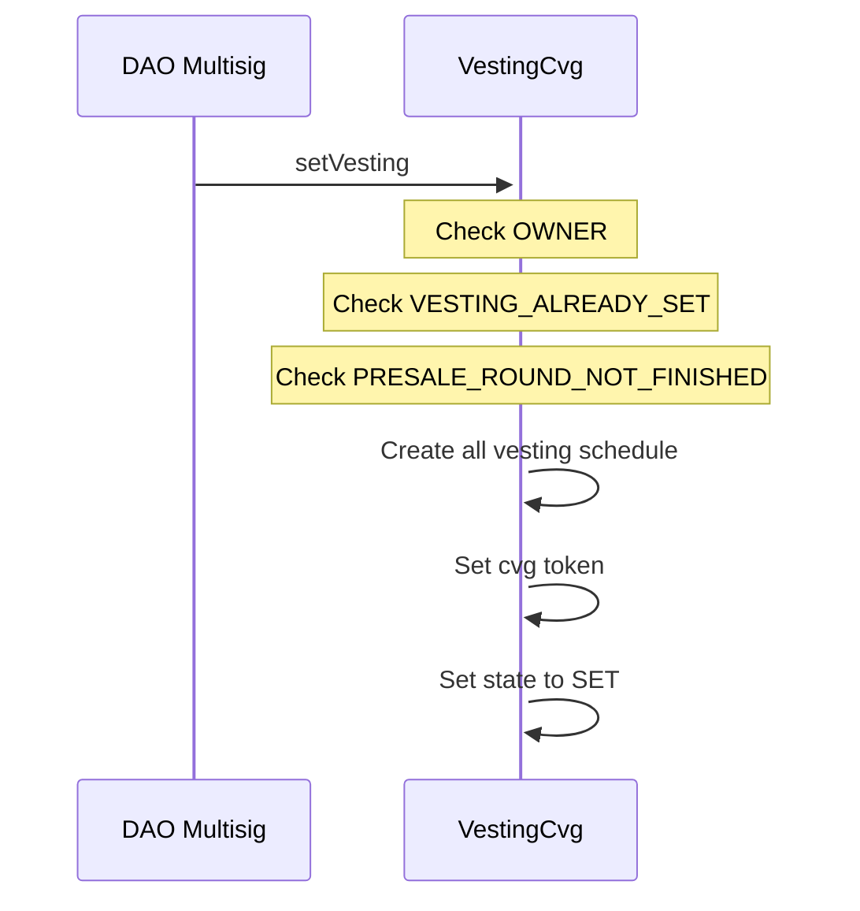
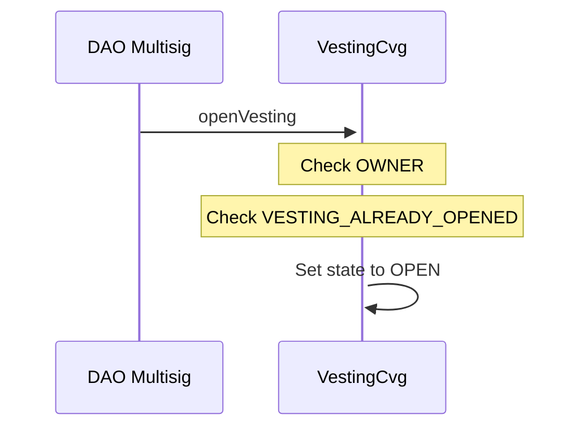
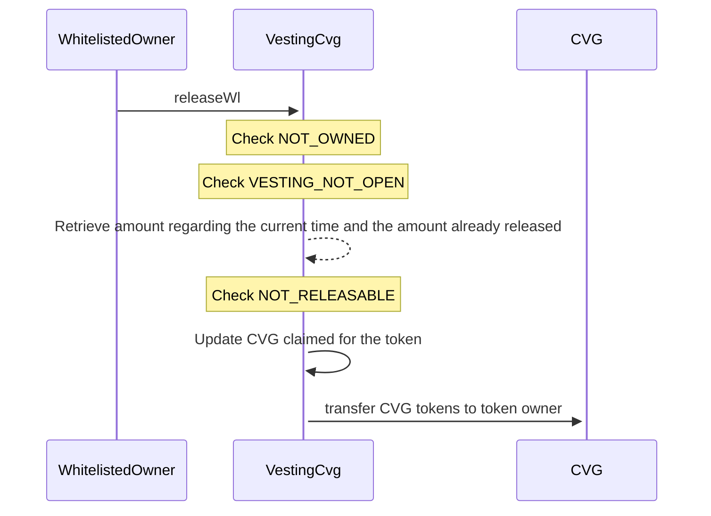
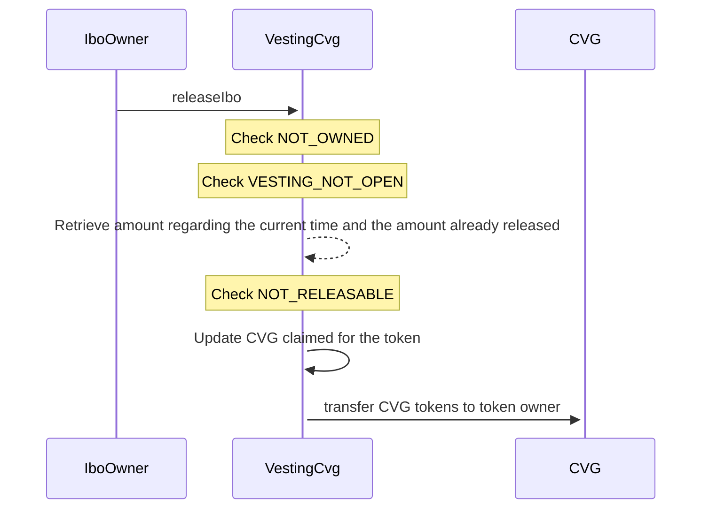
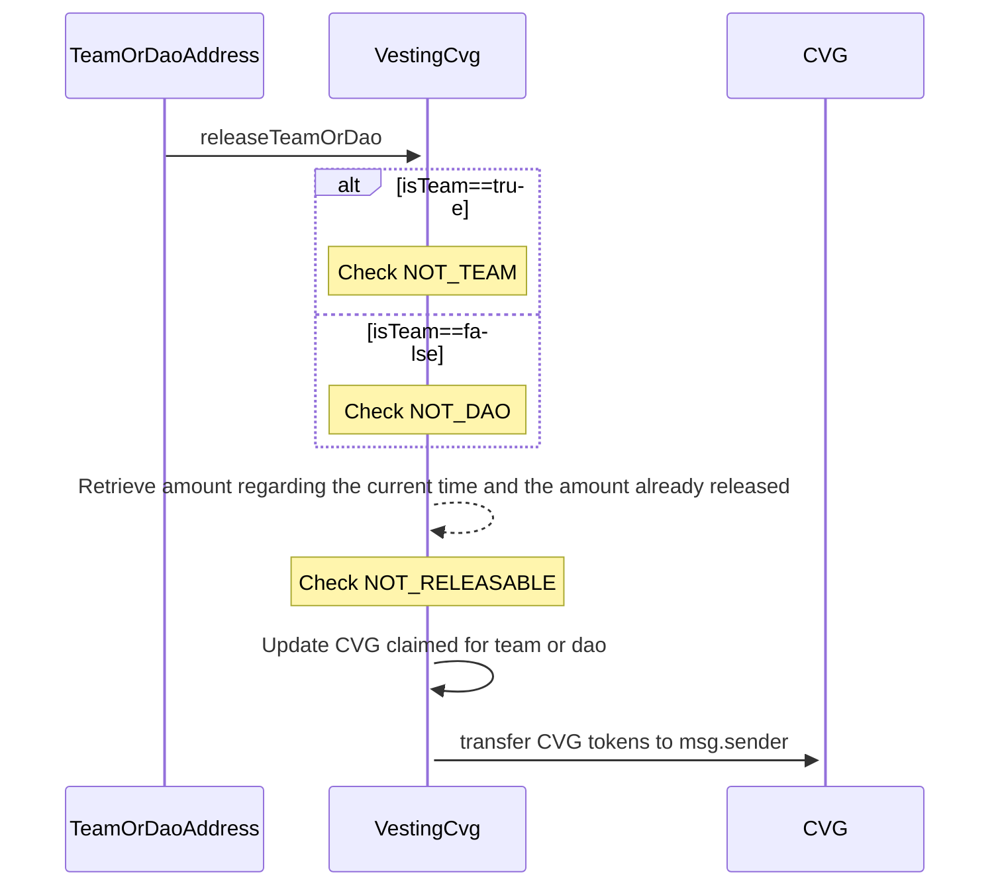

# VestingCvg

## Description

The `VestingCvg` is used to vest in the time the CVG token for seeders, presalers, ibo, team and the dao.
Owner of this contract will need to transfer CVG tokens on it and create the vesting schedule associated to the type of the vesting, to lock the CVGs into it.
Only user who own the NFTs from `SeedPresaleCvg`, `WlPresaleCvg` and `Ibo` can `release` the CVG associated to the given NFT.
For the team and dao allocation, only the addresses associated will be able to `releaseTeamOrDao`.

## SetVesting

Initiate the vesting period from the current timestamp, establish vesting schedules for each type of vesting, verify that the CVG balance matches the total amount allocated for all vesting schedules, and then mark the status as SET.

## OpenVesting

Activate the vesting for everyone by changing the status to OPEN.

## ReleaseSeed

As the owner of a SEED NFT Presale, he has the ability to release his vested CVG, calculated linearly from the initial cliff period to the end of the vesting term.

## ReleaseWl

As the owner of a WL NFT Presale, he has the ability to release his vested CVG, calculated linearly from the initial cliff period to the end of the vesting term.

## ReleaseIbo

As the owner of a IBO NFT Presale, he has the ability to release his vested CVG, calculated linearly from the initial cliff period to the end of the vesting term.

## ReleaseTeamOrDao

As a whitelisted TEAM or DAO address, he has the ability to release his vested CVG, calculated linearly from the initial cliff period to the end of the vesting term.

