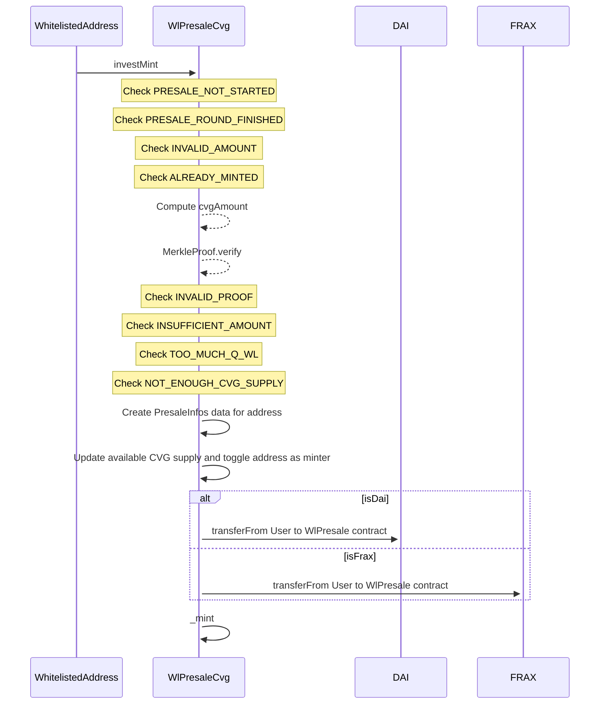
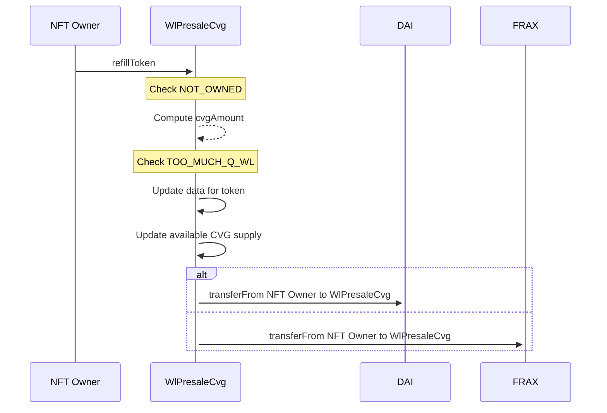

# WlPresaleCvg

## Description

During the presale phase, the `WlPresaleCvg` contract will be used to collect all the investments from whitelisted addresses.
This contract uses merkletree to list all the addresses (more gas efficient when the listing is very long).

An Wl user with `investMint` can transfer DAI or FRAX to create his Presale position represented by an NFT. There is a minimum and a maximum investment that is defined by the size of the WL (S,M,L). It is also possible to refill the investment (on the same NFT) with `refillToken` if the max size is not reached.

### investMint

### refillToken

