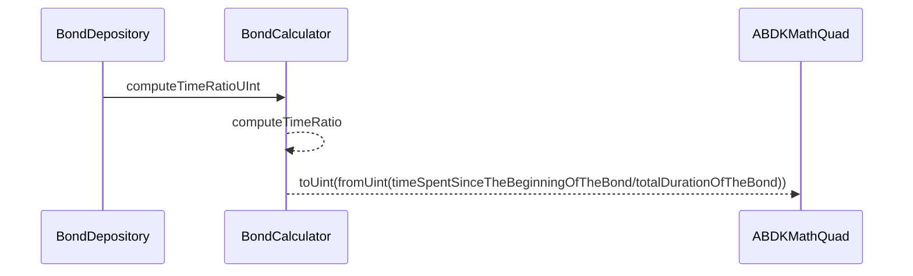
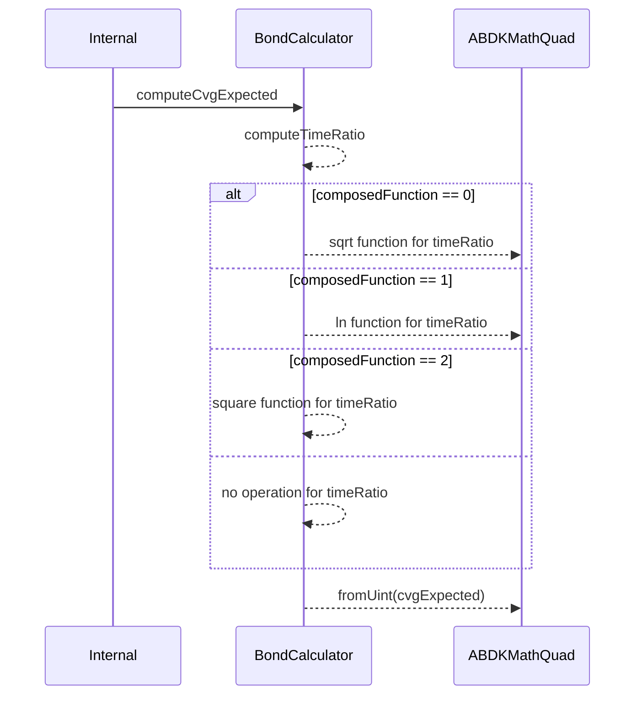
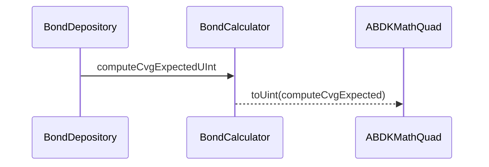
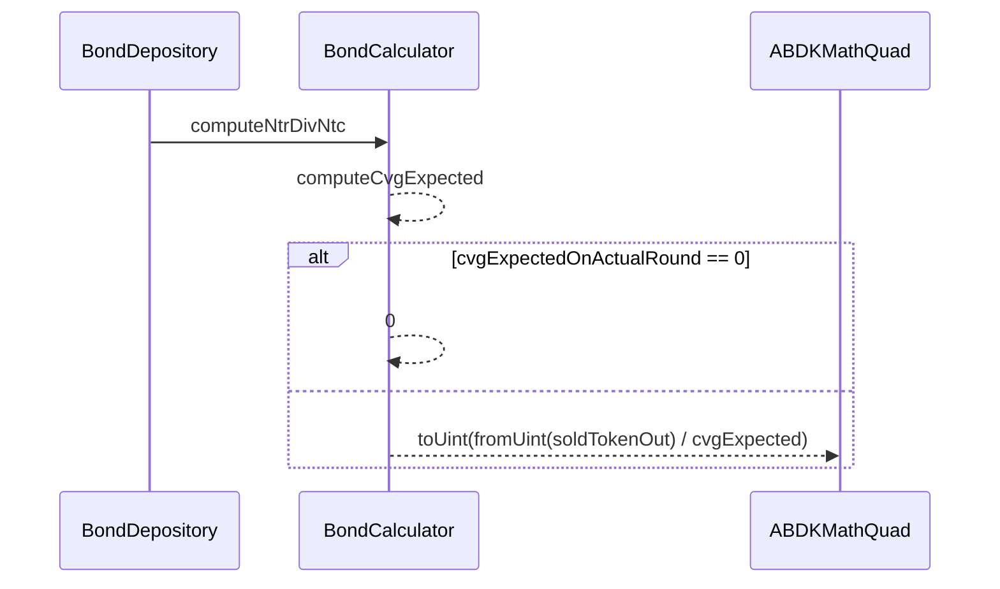
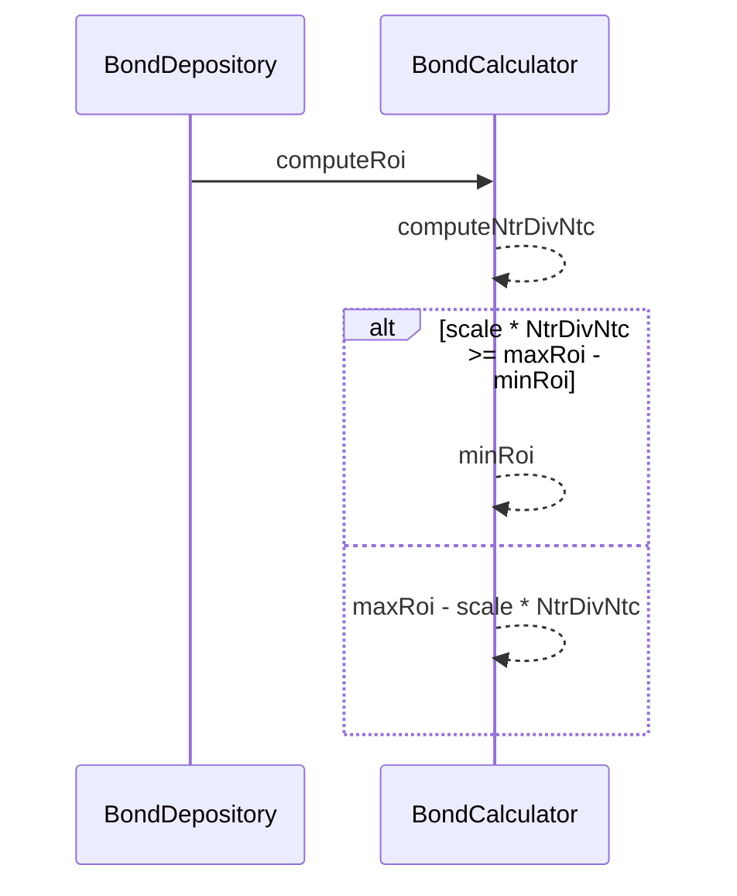

# BondCalculator

This contract allows to compute the discount of a bond. This computation is done on the fly of a deposit. Which means that ROI of the bond is automatically adjusted. It uses the `ABDKMathQuad` library to preserve precision when math operation with floating number happens and specific functions are needed such as **ln**.

To keep it simple:

- The more we get closer to the end duration of the bond, the higher the ROI will be
- The more we get closer to the sold target, the lower the ROI will be.

## Compute ROI Bond

The `BondCalculator` contract aims to compute the proper ROI (Return Of Investment) of a bond.
ROI changes according to :

- The time _t_ passed since the creation of the bond, compared to the end of the bond _T_
- Distributed CVG _Ntr_
- Max CVG to be distributed _maxDistr_
- The composed function type _func_ (sqrt, ln, square or linear)
- The _minRoi_ & _maxRoi_ configured

```js
// First compute the expected CVG token distributed
`Ntc` = func(t/T) * maxCapacity

// Compute the number of slice to remove from the maxRoi
`ratio` = ( Ntr / Ntc ) / Gamma%

// Remove ROI by slices of scale%
`ROI` = maxROI - ratio * scale

// IF ROI < minRoi => ROI = minRoi
```

### computeTimeRatioUInt

It computes the time ratio representing the progression on a bonding round => `t/T` in `bytes16`.



### computeCvgExpected

It computes the expected amount of $CVG tokens to be minted at this moment.



### computeCvgExpectedUInt

It computes the expected amount of $CVG tokens to be minted at this moment in the `UInt` format of `ABDKMathQuad` library.



### computeNtrDivNtc



### computeRoi

It computes the ROI of a bond with the values provided as function's arguments.


