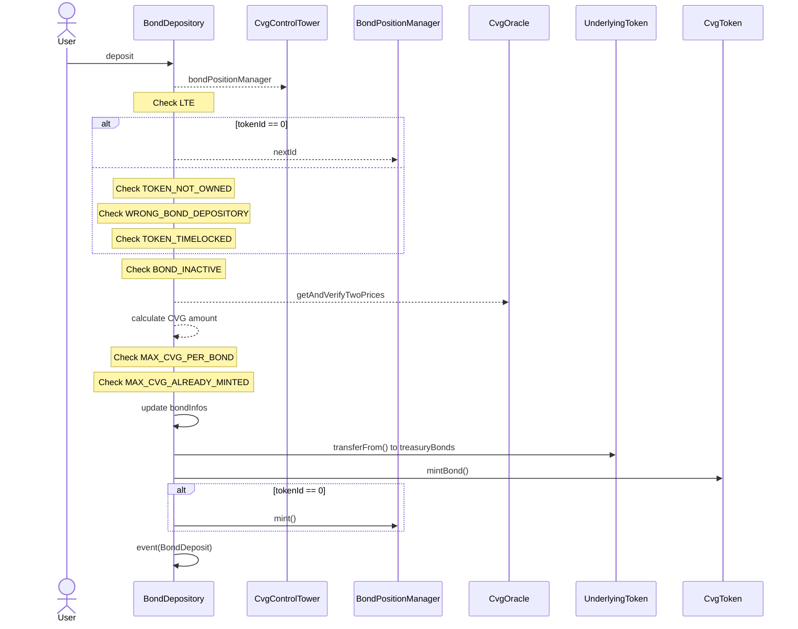
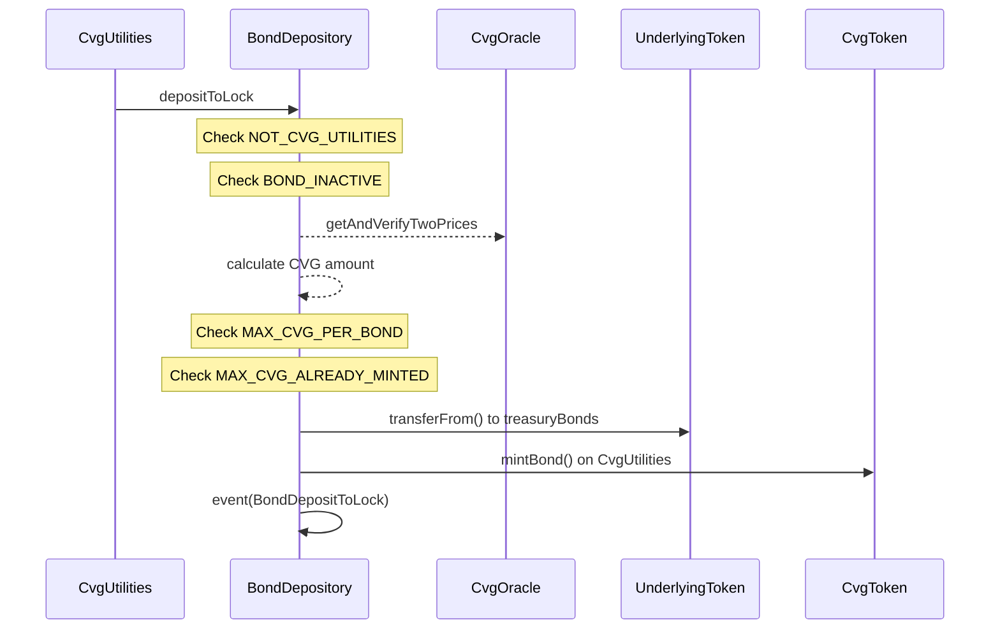
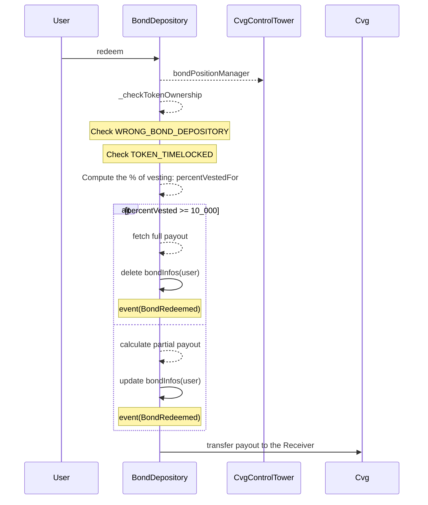

# BondDepository

The purposes of a `BondDepository` contract is to obtain ERC20 token from users by selling $CVG for other asset at a discount price. Those ERC20 allows us to build a treasury.
Bond emission will be issued by the financial team.

- Deposit
- Redeem
- ROI calculation (using oracles)

PS: A security system is implemented to prevent price manipulation, the prices are checked on a liquidity pool through the `CvgOracle` and a `ChainlinkAggregator` if available for the underlying asset.
If the difference between both prices is too high: the deposit is reverted

## Bond contract deployment

The `BondDepository` contract is deployed once. All other contracts are clones of the base version.
In order to clone a new bond contract, the `initialize` method is called on the `BondDepository` contract at the creation of contract in `CloneFactory`.
The arguments are:

- `_cvgControlTower`: address of the `CvgControlTower` contract.
- `_bondParams`: all the data needed to define the underlying asset and the limit of the feature.

This follows the **EIP-1167** recommendation  
https://eips.ethereum.org/EIPS/eip-1167

### deposit

All bond contracts are linked to an underlying asset, all deposits are made in this underlying asset.
When a user makes a deposit, he is credited with a number of $CVG tokens that is calculated using the ROI of the bond contract.
$CVG tokens are vested over the period of the bond contract.

### depositToLock

Same behavior as the `deposit` function but with the intent to lock the received amount of $CVG tokens.
The advantage of using this mechanism is to get a bigger locking position due to more $CVG being minted thanks to the discount price of the bond system.
In addition to this advantage, the user bypass the vesting time of the bond to directly get his veCvg and/or ysCvg according to the locking position.
It is only callable by the `CvgUtilities` contract.

### redeem

When an owner of an NFT with an ongoing deposits for a given bond contract, he can claim on **ANY receiver** the vested $CVG tokens. The function can be called at any time.
When a User redeems before the end of the vesting, it transfers an amount of $CVG regarding the ratio of time that last before the end of the vesting.

