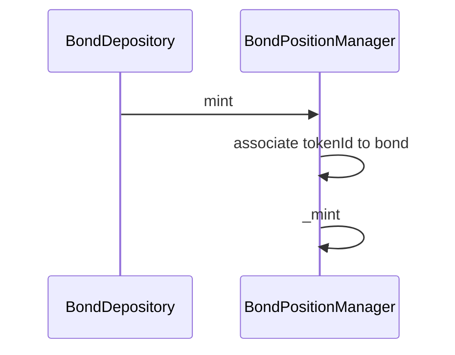
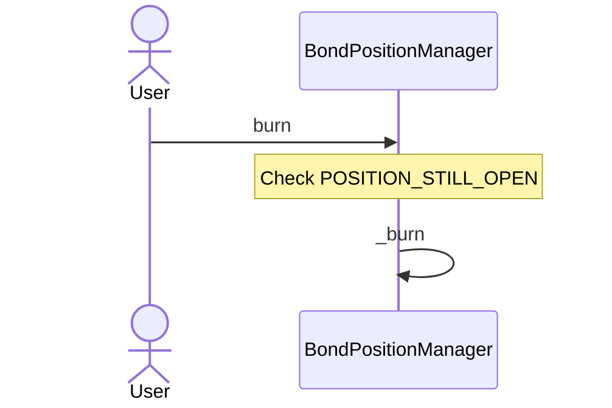

# BondPositionManager

## Global description

`BondPositionManager` contract is a `CvgERC721TimeLockingUpgradeable` NFT contract.

NFT bonds are only mintable when a User performs a **deposit** in a `BondDepository`. Each position is linked to a `BondDepository` contract on the mint. An NFT can be refilled if the user doesn't want to manage several NFT.

NFT bonds are only burnable by the owner of the NFT and if all the $CVG linked to position have been redeemed.

### mint

Mint an NFT to represent a user's bond position.

### burn

Burn an NFT and therefore its attached bond position.
Only possible if the position is closed (rewards have fully been claimed).

