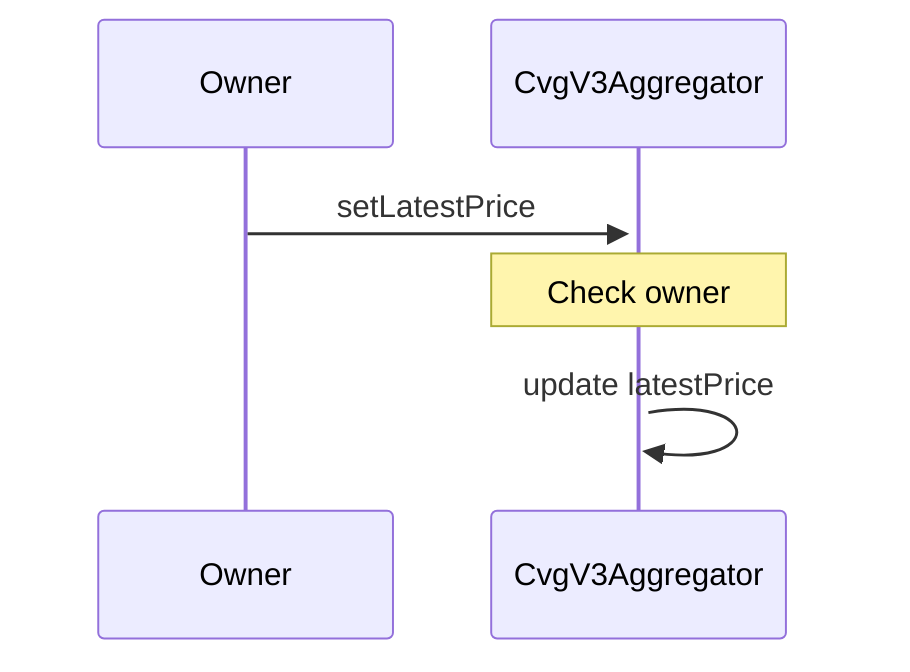
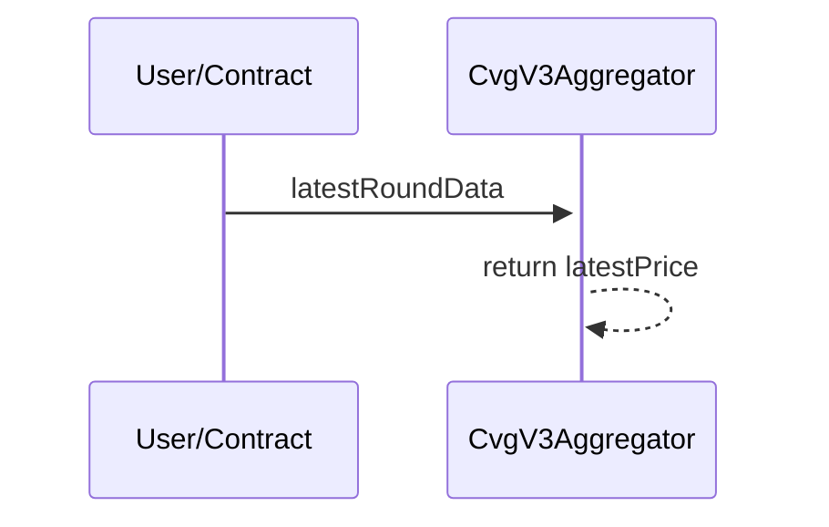

# CvgV3Aggregator

## Description

The `CvgV3Aggregator` is used to imitate a `chainlinkOracle` Aggregator if the price feed for a given asset is not available on Chainlink. When the cvgOracle calls one of our aggregator, he will call the same function signature as the chainlink's one.
As owner of the CvgV3Aggregator, the team will update the latest price to protect and verify the price in our `Bond` program. If the difference between the pool price and the aggregator price is too big. This will block deposits on the concerned `BondDepository` contract.

## Set Latest Price

## Latest Round Data

