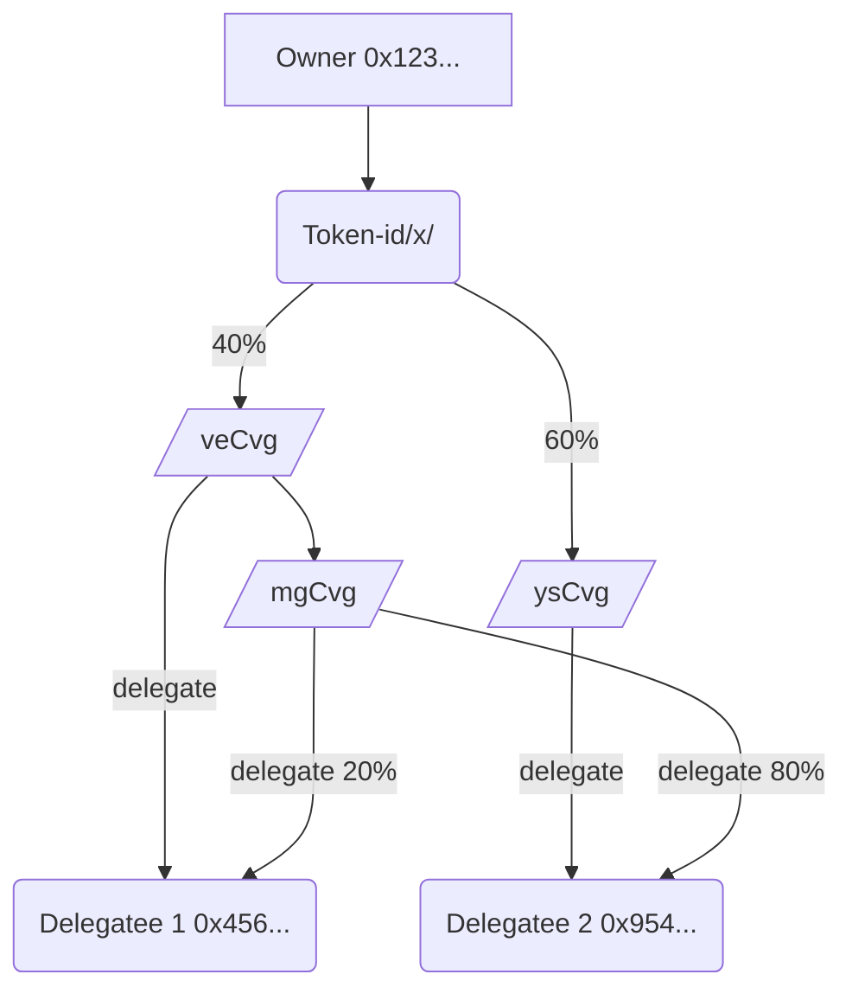
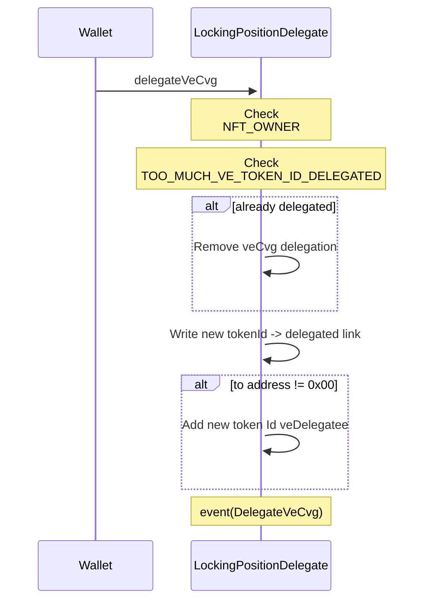
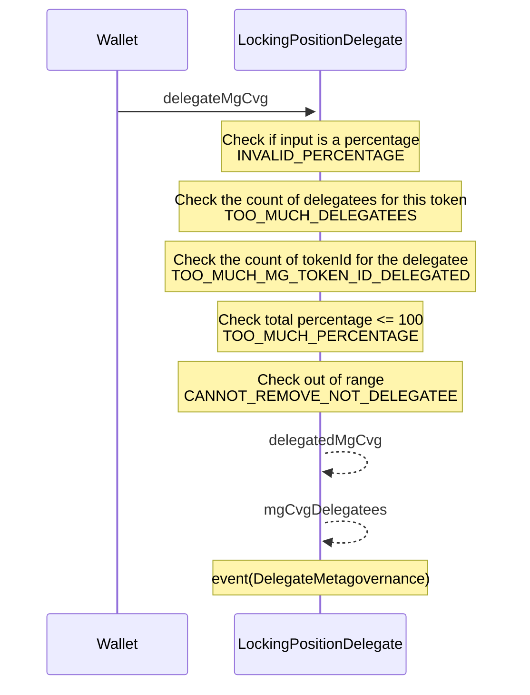
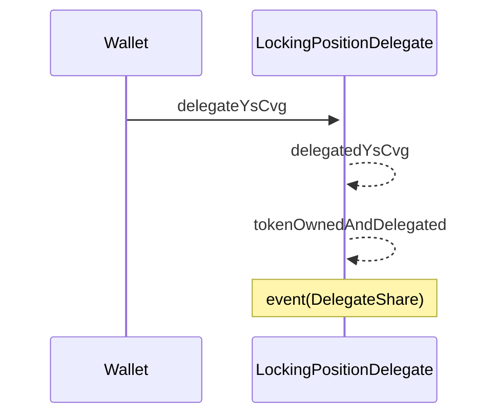
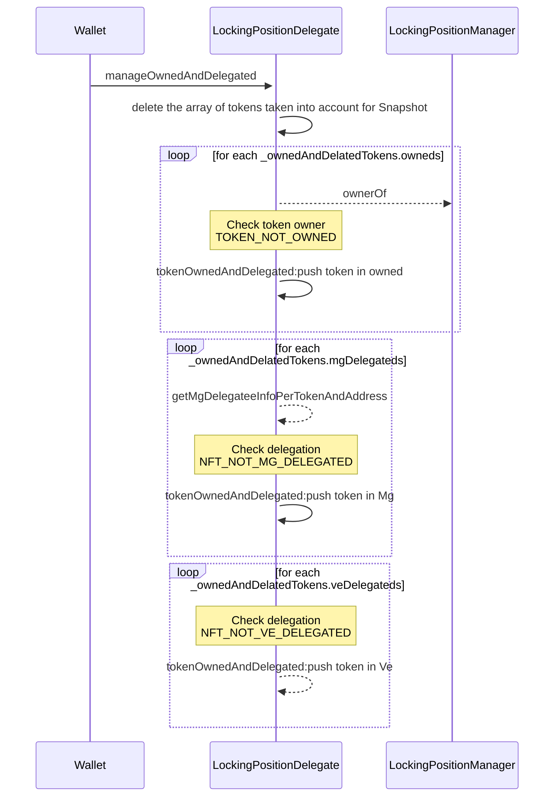

# LockingPositionDelegate

## Global description 

This contract manages the delegation of VeCvg, YsCvg, and MgCvg for locking positions.

- A locking position (NFT `LockingPositionManager`) can have three types of feature (represented by 3 subAsset stored in the Locking NFT )
- This contract is used to manage the delegation of  this different types of feature.
- Delegation work with token ID , but each subAsset can be delegated independently( with different rules cf. Rules of delegation)

## Sub assets description 

- Users can delegate their **VeCvg** to another address to : 
  - vote on the GaugeController and the Convergence Snapshot.
  - Can be delegated to one address
- Users can delegate their **YsCvg** to 
  - another address to claim TDE rewards on their behalf.
  - Can be delegated to one address
- Users can delegate their **MgCvg**  to : 
  - vote on Snapshot meta-governance proposals.
  - Can be delegated to multiple address (5) with a percentage multiple of 10
- There is a maximum of 25 **tokenIds** that can be delegated to any one address.

## An example of delegated situation

## Delegate VeCvg (delegateVeCvg)

Allows the owner of an NFT (identified by _tokenId) to delegate their veCVG (voting power) to another address

### **Parameters :**
- _tokenId: The unique identifier of the NFT whose veCVG is being delegated.
- _to: The address of the new delegatee. If this is the zero address (0x0), it indicates the intention to remove the delegation.
### **Validation :**
- The function ensures that the new delegatee does not exceed the maximum number of delegated token IDs.
- It also checks that the function caller is the owner of the NFT.
### **Process :**
- If the delegatee is not the zero address, the NFT's veCVG is associated with the new delegatee's address.
- The _tokenId is then added to the new delegatee's list of delegated token IDs.

### **Diagram :**

## Delegate MgCvg (delegateMgCvg )

### **Parameters :**
- _tokenId: The unique identifier of the NFT whose mgCvg voting power is being delegated.
- _to: The address to which the mgCvg is being delegated.
- _percentage: The portion of the mgCvg voting power that is being delegated, expressed as a percentage.

### **Validation :**
- ONly owner can call this method
- Ensures that the delegation does not exceed 100%.
- Verifies that the number of delegatees does not surpass a predefined maximum.
- Checks that a delegatee does not have too many NFTs delegated to them.
- Ensures that the new total delegated percentage does not exceed 100% when adding to existing delegations

### **Process :**
- a new MgCvgDelegatee struct is created or updated with the delegatee's address and the specified percentage.
- If the percentage is 0 and the address is already a delegatee, the function removes that delegation.
- If the delegatee is being added for the first time, their address is added to the mgCvgDelegatees array
- If the delegation is being removed, the function cleans up the delegatee's entry from the tracking arrays.
### **Diagram :**

To delegate a specified percentage of an NFT's meta-governance voting power to another address, with the capability to delegate to multiple addresses and adjust the percentage as needed.

## Delegate YsCvg (delegateYsCvg)

Enables the delegation of yield shares from an NFT's locking position to another user, 
allowing the delegatee to claim rewards associated with that NFT.

### **Parameters :**
- _tokenId: The unique identifier of the NFT whose yield shares are to be delegated.
- _to: The Ethereum address to which the yield shares are being delegated.

### **Validation :**
- only the owner of the token can delegate it.

### **Diagram :**

## manage Delegation  (manageOwnedAndDelegated)

The manageOwnedAndDelegated function is a governance feature that allows users to specify which of their tokens (NFTs) should be considered when calculating their voting and meta-governance power. 
It's designed to prevent potential abuse by bad actors and to ensure efficiency in vote calculation.

**Protection Against Spam**: By letting users manage their tokens, the system prevents bad actors from spamming a user's address with many low-value VE (Voting Escrowed) or MG (MetaGovernance) positions, which could otherwise lead to out-of-gas (OOG) 
errors during voting power calculation due to excessive token processing.

### **Parameters :**
 - _ownedAndDelatedTokens: A struct containing arrays of token IDs that the user owns or has been delegated voting power (both VE and MG).

### **Validation :**
- this function is only callable by the delegatee of the token.
- each token is tested for ownership or delegation.

### **Process :**

- Clear existing Records.
- For each token in the owned array:
  - Add Owned Tokens
  - Add MG Delegated Tokens
  - Add VE Delegated Tokens

### **Diagram :**

## Clean veDelegation (_cleanVeDelegatee )

The function is designed to remove the delegation of veCVG associated with a specific NFT represented by _tokenId. Delegation here means that the NFT's voting power has been assigned to another address (delegatee).

### **Parameters :**
- `_tokenId`: The unique identifier of the NFT from which the delegation is to be removed.
- `isRemoveByDelegatee`: A boolean indicating whether the removal is being initiated by the delegatee themselves.

### **Validation :**
- If the action is initiated by the delegatee (isRemoveByDelegatee is true), the function checks that the caller (msg.sender) is the current delegatee recorded for the _tokenId.

### **Process :**

- Find the previous owner (delegatee)
- Remove the token the previous owner  (delegatee)
- Set the address to 0x0

## Clean mgDelegation (_cleanMgDelegatees )

The _cleanMgDelegatees function is an internal contract method for removing all meta-governance (mgCvg) delegation entries associated with a specific NFT, identified by _tokenId.

### **Parameters :**
- `_tokenId`: The unique identifier of the NFT from which the delegation is to be removed.

### **Validation :**
- onlyTokenOwner

##  **Process :**

- For each delegatee (_to): 
  - The function finds the index (_tokenIdIndex) of the _tokenId within the mgCvgDelegatees array, which tracks all tokens delegated to that delegatee.
  - It then removes the _tokenId from the delegatee's list.
  - Clearing the entire record of its delegations.

## Storage logic 

`delegatedVeCvg`

This mapping stores the delegated VeCvg address for a tokenId. The key is the tokenId, and the value is the address of the delegatee.

`veCvgDelegatees`

This mapping stores the tokenIds that have their VeCvg delegated to a particular address. The key is the address of the delegatee, and the value is an array of tokenIds.

`delegatedYsCvg`

This mapping stores the delegated YsCvg address for a tokenId. The key is the tokenId, and the value is the address of the delegatee.

`delegatedMgCvg`

This mapping stores the delegated MgCvg addresses and percentages for a tokenId. The key is the tokenId, and the value is an array of MgCvgDelegatee structs. Each MgCvgDelegatee struct has two fields: delegatee, which is the address of the delegatee, and percentage, which is the percentage of MgCvg that is delegated to the address.

`mgCvgDelegatees`

This mapping stores the tokenIds that have their MgCvg delegated to a particular address. The key is the address of the delegatee, and the value is an array of tokenIds.

`tokenOwnedAndDelegated`

This mapping stores all the tokens (owned and delegated) containing mgCvg and veCvg for an address. The key is the address of the account, and the value is an OwnedAndDelegated struct. Each OwnedAndDelegated struct has three fields: owneds, which is an array of tokenIds that the address owns, mgDelegateds, which is an array of tokenIds that the address has delegated their MgCvg to, and veDelegateds, which is an array of tokenIds that the address has delegated their VeCvg to.