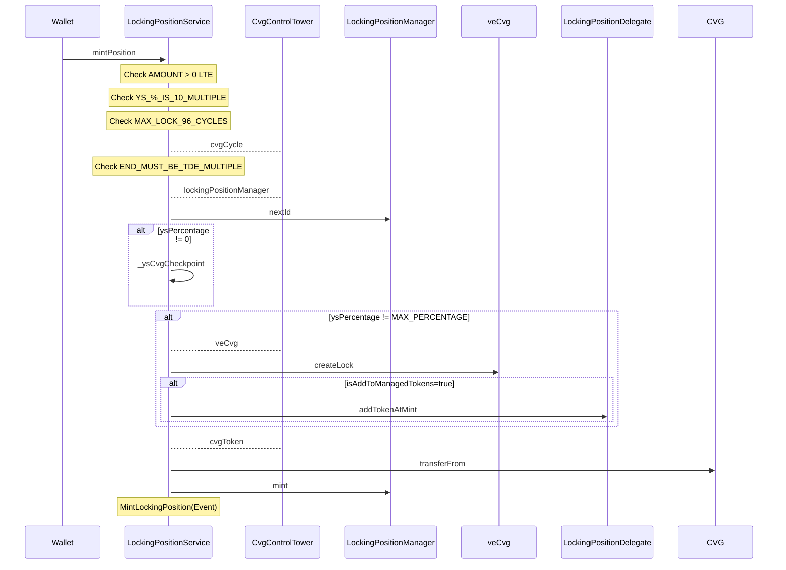
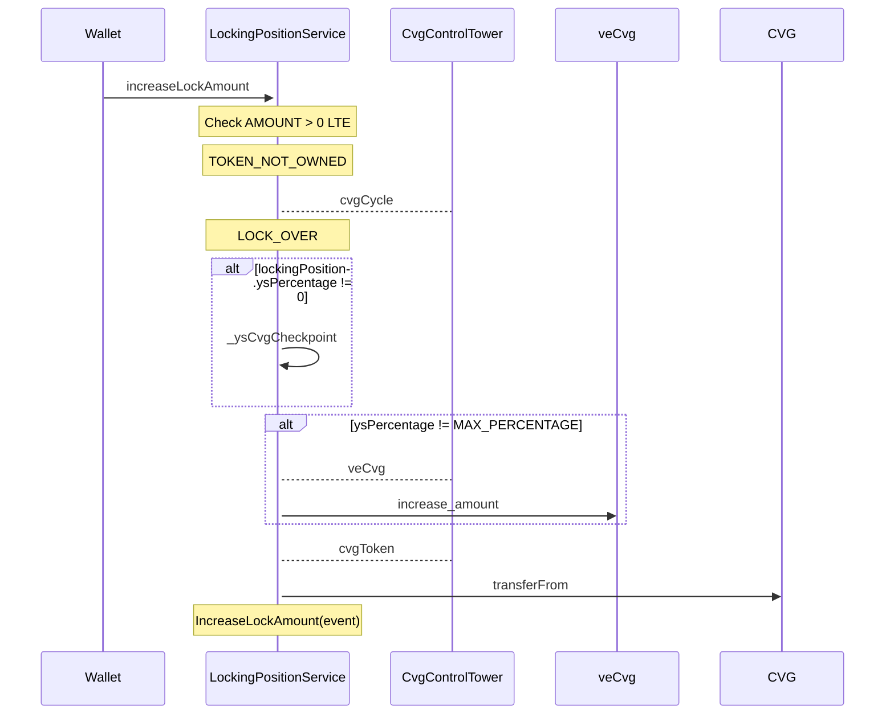
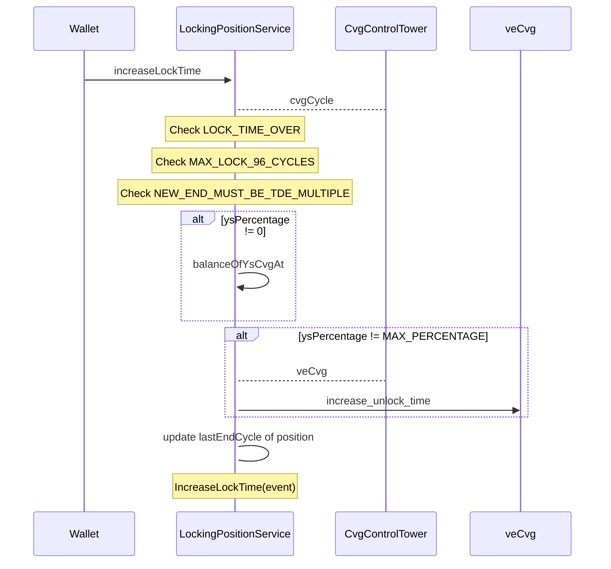
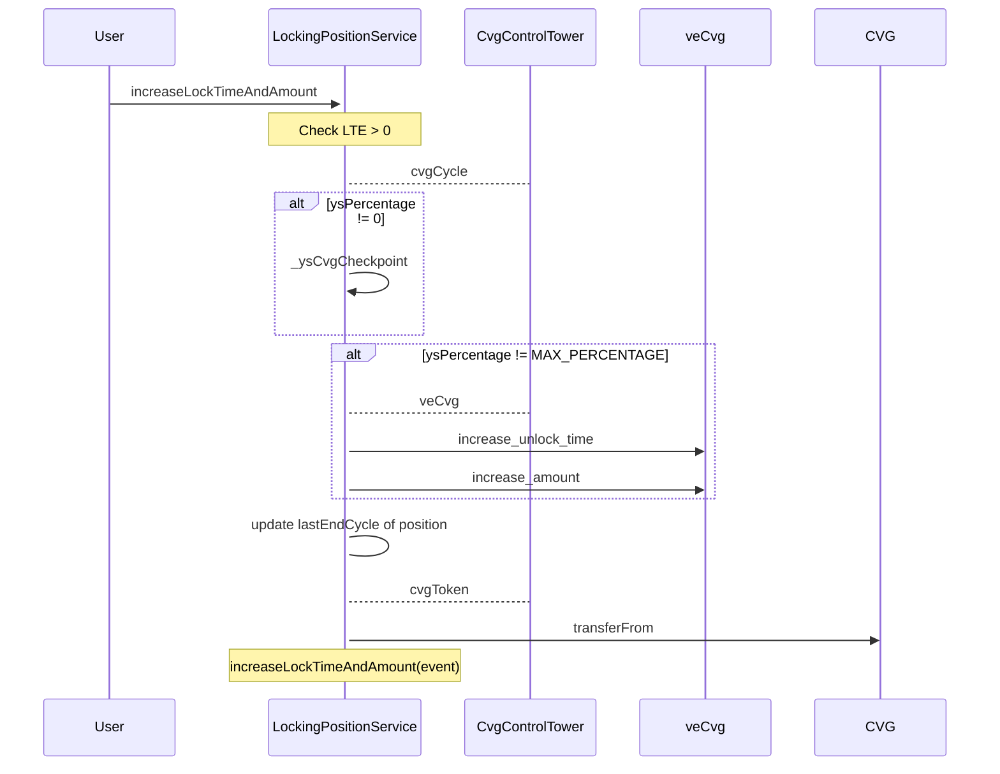
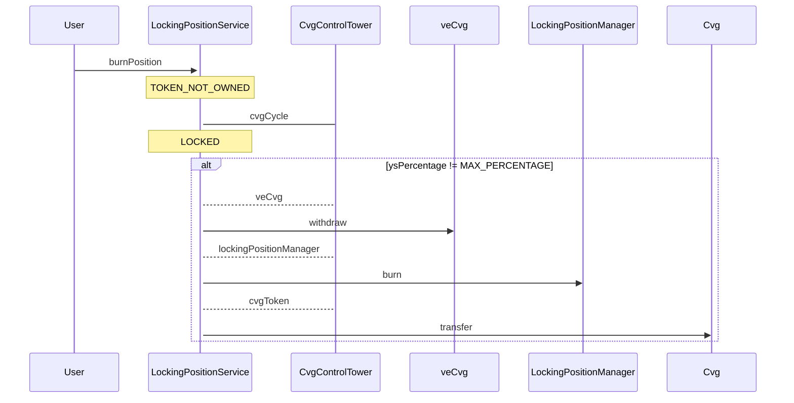

# LockingPositionService

## Global description

This contract :

The `LockingPositionService` is a contract which contains all the action methods for the NFTs of the `LockingPositionmanager`
- Allows to lock an amount `$CVG` during a number of cvg cycle ( 1 cycle = 1 WEEK approx ) in exchange for an NFT that contains :
  - `ysCvg` value, used to compute the amount of share that the NFT will be able to claim at each **TDE** that occurs every 12 cvg cycles. This computation is done internally by the `LockingPositionService`.
  - `veCvg` value, used to vote on `GaugeController` and on Governance **Snapshot** proposals. This computation is done externally by the `veCvg`.
  - `mgCvg` value, used to vote on MetaGovernance **Snapshot** proposals. This computation is done internally by the `LockingPositionService`.

Each lock actions (mint, increaseTime & increaseTimeAndAmount) requires that the length of the active lock is not over **96 cvg cycles**.

Involved contracts:

- contracts/CvgControlTower.sol
- contracts/Locking/LockingPositionService.sol
- contracts/Locking/LockingPositionManager.sol
- contracts/Locking/veCvg.vy
- contracts/Token/Cvg.sol

## <u>Mint Position Locking : </u>

### **Description:**

A user OR a WL contract / multisig can lock an **amount** of CVG (ERC20) for a **lockDuration**. 
The transaction issues an NFT that embed the Locking Position.

### **Parameters:**
- `lockDuration`: The duration in cycles (weeks) of the lock.
- `amount`: The amount of CVG to lock in the position.
- `ysPercentage`: The percentage of the lock dedicated to treasury shares (ysCVG). the other part is dedicated to veCvg (and mgCVG)
- `receiver`: The address of the receiver of the locking position.
- `isAddToManagedTokens`: Whether to add the created token to managed tokens (voting power) directly.

### **Validation:**
- Restricts to  user's wallet or authorized contracts( to avoid locking concentration by non-authorized mutisig)
- The function ensures the amount is greater than zero.
- It checks that the ysPercentage is not over 100% and is a multiple of 10, which is likely a required increment for stake allocation.
- It validates that the lockDuration does not exceed the maximum allowed period (MAX_LOCK), indicating a cap on how long tokens can be locked.
- It asserts that the lock must end on a TDE event cycle, enforcing alignment with the platform's yield distribution schedule.

### **Diagram :**

## <u>Increase Lock Amount :</u>

This function is designed to increase the amount of CVG (possibly a cryptocurrency token) locked
in a loking  position before the locking period ends. 
It allows a user to add more  CVG tokens to their current locking position to potentially increase their 
treasury reward  share  (ysCVG) or voting power (veCVG) depending on the initial repartition of the token.

### **Parameters :**
- `tokenId`: Represents the identifier of the locking position to which the CVG tokens are to be added.
- `amount`: The number of CVG tokens to be added to the locking position.
- `operator`: The address of the token owner or the address that is authorized to perform the operation.

### **Validation:**
- The function ensures that the amount to be added is greater than zero.
- It checks the ownership of the token via _checkTokenOwnerShip function.
- It verifies that the locking position is still active and not expired ("LOCK_OVER").

### **Process:**
The calculated value is preserved within the LockingExtension mapping, which is structured to ascertain the amount for any given cycle, including those projected in the future.

### **Diagram :**

## <u>Increase Lock Time : </u>

The increaseLockTime function is designed to extend the duration of an existing lock on a token without increasing the locked amounts of ysCvg & mgCvg. 
These amounts will remain the same but will be spread over the new, extended duration

### **Parameters :**
- `tokenId`: This is the unique identifier of the locking position whose duration is to be extended.
- `durationAdd`: This is the number of cycles by which the lock duration is to be extended.

### **Validation :**
- The current position has not expired 
- The new end cycle does not exceed the maximum allowed lock duration (MAX_LOCK=96).
- The additional duration (durationAdd) is a multiple of a predefined duration (TDE_DURATION=12), to align lock expiration with predefined intervals.

### **Process:**
For ysCvg : The code retrieves the balance of ysCvg that is to be reported at the cycle immediately 
before the old end cycle using a function, using the mapping `balanceOfYsCvgAt` for ysCVG the extension 
then   the extension is added to the `totalSuppliesTracking` mapping.

For veCvg : the process is externalized to the `veCVG ` contract.

### **Diagram :**

### <u>Increase Lock Time and Amount : </u>

The function is meant to first extend the time during which the CVG tokens are locked and then to increase the amount of CVG tokens in the locked position.

### **Parameters :**
- `tokenId`: Identifier for the locked position 
- `durationAdd`: The number of cycles by which the locking time should be extended.
- `amount`: The additional number of CVG tokens to be added to the locked position.
- `operator`: The address of the token owner or an authorized operator.

### **Validation :**
- The amount to be added must be greater than 0.
- The locking position must not be already expired 
- The total duration of the lock after adding durationAdd must not exceed the MAX_LOCK(96) constant.
- The added duration must align with the TDE_DURATION(12), ensuring it ends on a predefined cycle boundary.

### **Process :**
- The time is processed first in order to get the actual amount in line with the new duration.
- The amount is process second for the current cycle.

- For the amount : The calculated value is preserved within the LockingExtension mapping, which is structured to ascertain the amount for any given cycle, including those projected in the future.
- For time : 
  - For ysCvg : The code retrieves the balance of ysCvg that is to be reported at the cycle immediately
  before the old end cycle using a function, using the mapping `balanceOfYsCvgAt` for ysCVG the extension
  then   the extension is added to the `totalSuppliesTracking` mapping.
  - For veCvg : the process is externalized to the `veCVG ` contract.

### **Diagram :**

### <u>Burn Lock Position</u>

This specific function allows a user to unlock and retrieve their CVG tokens that are locked within
an NFT position by burning it.

- Transfer **ALL** locked Cvg(ERC20) back to the user ( from initial lock & extensions)

### **Validation :**
- The locking position must  be  expired
- The locking position must be owned or the caller

### **Process :**

- The token is removed from the `veCvg` contract
- The token is burnt 
- The CVG is transferred to the caller

### **Diagram :**

## Example of YS Share computing  (_ysCvgCheckpoint)

Now, consider a user wants to create a lock with the following details:

- lockDuration: 24 cycles (which means the user wants to lock their CVG for 24 cycles).
- cvgLockAmount: 2400 CVG tokens (the amount the user wants to lock).
- actualCycle: 10 (the current cycle when the user is creating the lock).
- endLockCycle: actualCycle + lockDuration, which would be 10 + 24 = 34 (the cycle when the lock will end).

Given these values, let's compute the ysCVG:

Calculate ysTotalAmount:

Using the formula (lockDuration * cvgLockAmount) / MAX_LOCK we get: 
- (24 * 2400) / 96 = 600 ysCVG.

Determine the Real Start and End Cycles:
- realStartCycle = actualCycle + 1, so 10 + 1 = 11.
- realEndCycle = endLockCycle + 1, so 34 + 1 = 35.

Handle Offset for TDE:

- Since actualCycle % TDE_DURATION is not 0 (10 % 12), we must handle the offset:
Compute the next TDE cycle: 
- nextTdeCycle = ((10 / 12) + 1) * 12 + 1 = (0 + 1) * 12 + 1 = 13.
Calculate the ysNextTdeAmount for the first TDE: 
- ((13 - 11) * 600) / 12 = (2 * 600) / 12 = 100 ysCVG.

Adjust Total Supplies Tracking:

- Add ysNextTdeAmount to totalSuppliesTracking for the real start cycle:
- totalSuppliesTracking[11].ysToAdd += 100.
- Since the lock duration is greater than a TDE duration, we also adjust the next TDE cycle and the real end cycle:
- Add the remaining ysCVG to the next TDE cycle: totalSuppliesTracking[13].ysToAdd += 600 - 100 = 500.
- Finally, subtract the total ysCVG from the real end cycle: totalSuppliesTracking[35].ysToSub += 600.

In summary, for this example, the total supply tracking will be adjusted as follows:

- At the start of the lock (cycle 11), we are adding 100 ysCVG to account for the first TDE.
- At the next TDE (cycle 13), we add the remainder of the total ysCVG, which is 500.
- At the end of the lock (cycle 35), we subtract the total 600 ysCVG that was added during the lock duration.
- This function ensures that the ysCVG yield shares are properly tracked and adjusted over the lock duration, aligning with the TDE cycles for correct reward distribution.

## updateYsTotalSupply 

### Purpose
To adjust the total supply of `ysCvg` tokens by considering previously established checkpoints.

### Process
  - Retrieves the current cycle from the Control Tower.
  - The function takes a snapshot of the totalSupplyYsCvg before it's updated. This snapshot is then recorded in the totalSupplyYsCvgHistories mapping for the previous cycle (actualCycle - 1). This allows the contract to maintain a historical record of the total supply at the end of each cycle, which is important for calculating rewards and for users to verify past states.
  - Adjusts the total supply for the current cycle based on additions and subtractions from the totalSuppliesTracking mapping.
  - Emits an event `UpdateTotalSupplies ` for tracking and transparency.

## Anti lock concentration process 

key feature functions in this contract cannot be called with a contract until it was allowed, in order to avoid unwanted multisig concentration.
The modifier `onlyWalletOrWhiteListedContract` is used to do so.
we use the method  `toggleContractLocker` to allow/disallow a contract to call them.

methods : 
- mintPosition
- increaseLockAmount
- increaseLockTime
- increaseLockTimeAndAmount

# Voting power computation

- `veCvgVotingPowerPerAddress`: Determines the total veCVG voting power for a given address.
- `mgCvgVotingPowerPerAddress`: Calculates the total mgCVG voting power for a given address.

## Views method :

- `tokenInfos`:  Obtains data for displaying an NFT's lock position.
- `balanceOfVeCvg` : Obtains the amount of veCvg associated with a locking position.
- `balanceOfYsCvgAt`: Obtains the balance of ysCVG (treasury share) for a specified token ID at a given cycle, can be in the future.
- `balanceOfMgCvg`: Obtains the current balance of mgCVG for a specified token ID.
- `balanceOfMgCvgAt`: Obtains the balance of mgCVG (meta-governance voting power) for a specified token ID at a given cycle, can be in the future.

- `totalSupplyOfYsCvgAt`: Provides the total supply of ysCVG at a specified cycle,can be in the future.
- `getTokenRewardAmount`: Calculates the reward amount for a given token ID, TDE, and reward token.
