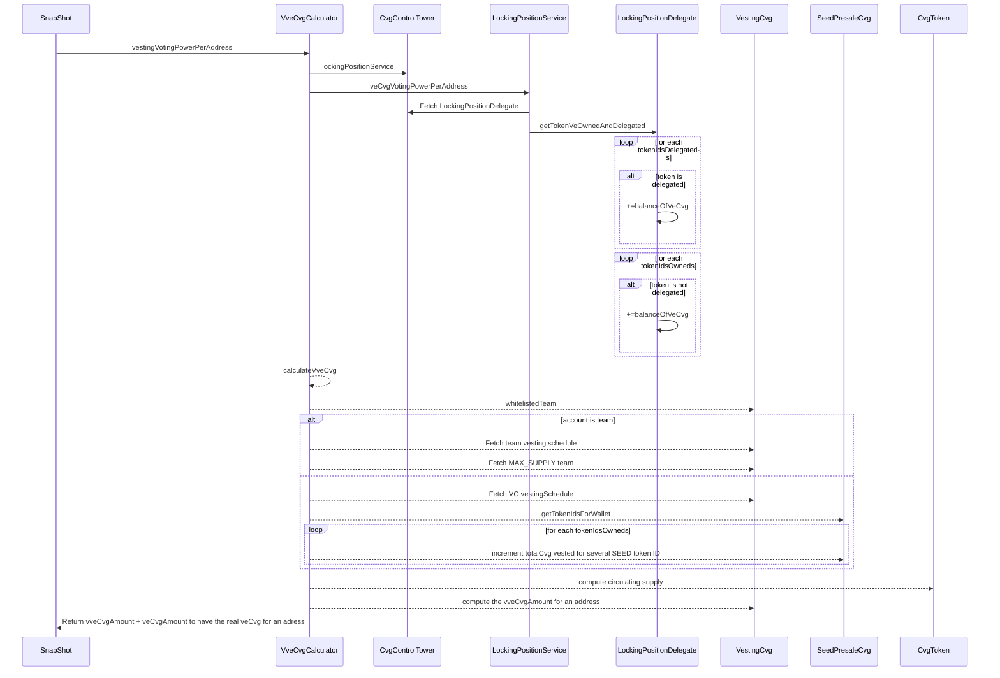

# vVeCalcator

The VveCvgCalculator performs calculations related to vesting and voting power for a token: CVG. 

- Integration with Presale and Vesting: Accounts for tokens bought in a presale and vested over time.
- Time-bound Calculations: Limits the voting power calculations to the vesting period, reflecting the decay of influence as tokens unlock.
- Governance Participation: Allows vested token holders to participate in governance, before their tokens are fully unlocked.

## calculateVveCvg

- Calculates the "vesting veCvg" voting power for a given account.
- The schedule is different for Team and VC accounts.
- Accounts for the total CVG emission less the amount dedicated to vesting schedules and treasury airdrops.
- The calculation is time-sensitive and only grants voting power if the current timestamp is within the vesting period.

## vestingVotingPowerPerAddress 

- Aggregates the voting power from veCvg (standard voting power from locked CVG tokens) and vveCvg (vesting voting power).

### Calculation of voting power for snapshot

The voting power of veCvg for **Snapshot** is calculated by address, so we need to regroup all positions that embed Voting Power. Also, SEED investors and team has by default a balance of `vveCvg` computed in the `VveCvgCalculator`. This default value decreases to 0 at the end of the vesting of these actors:
So to compute the voting of an address we need :

- The voting power of the locking position owned (available on the LockingPositionManager contract)
- The voting power of the locking position delegated
- The voting power of vested token (Team / Seed / Preseed)

