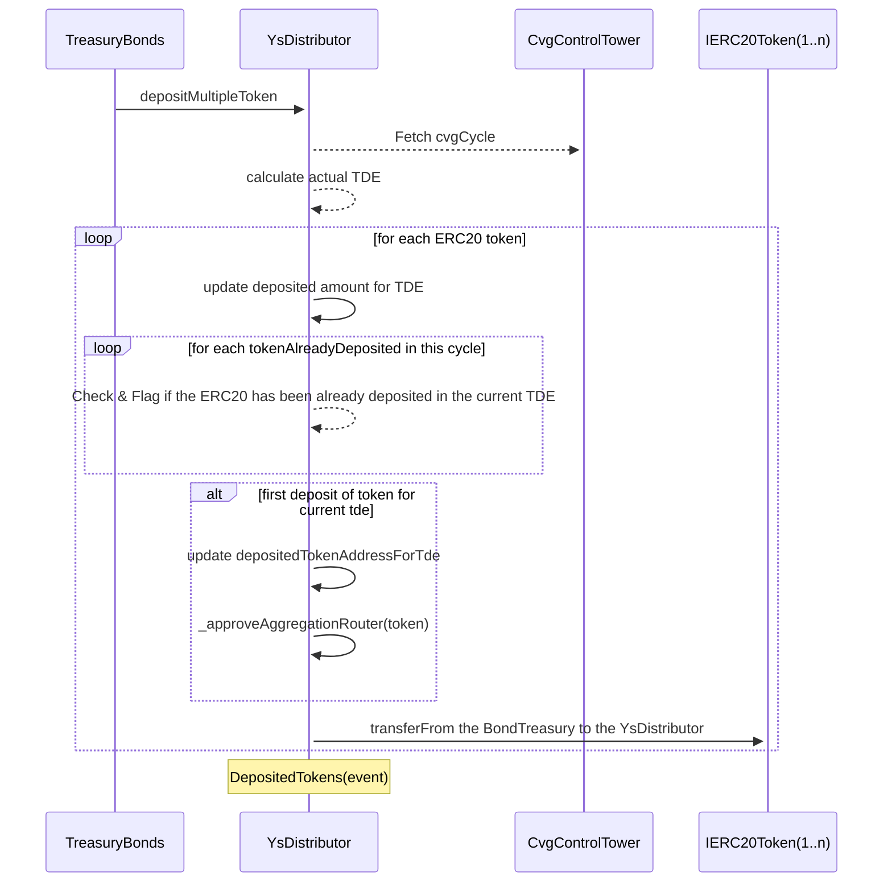
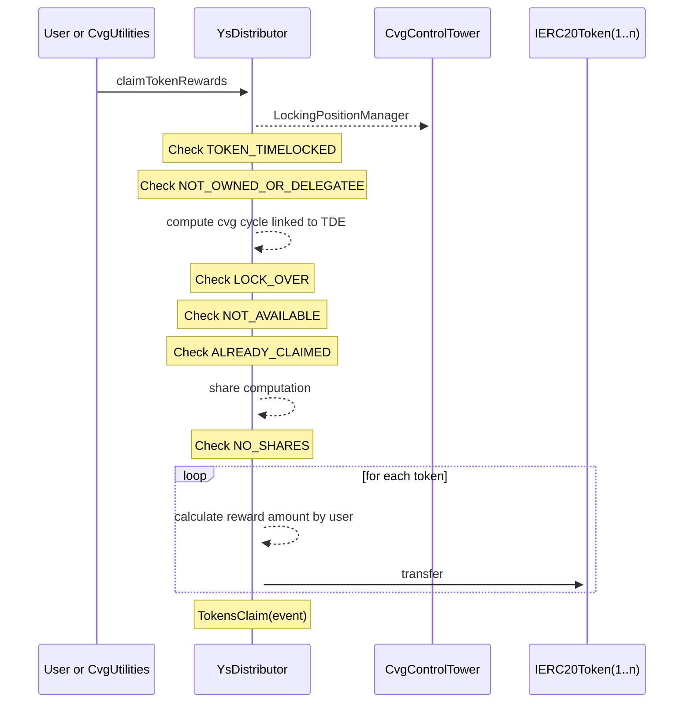

# YsDistributor

One of the feature of convergence protocol is to distribute the rewards of the treasury put to work in others protocols
to the ysCvg holders ( cf . locking)
There is multiple step in order to do that :

- Deposit the rewards on the YsDistributor contract( this step is done manually by the financial team)
- User can claim the rewards from the YsDistributor contract

## depositMultipleToken

The depositMultipleToken function is designed to accept multiple token deposits that will later be distributed during a Token Distribution Event (TDE).

Before each end of TDE ( Treasury Distribution events / `12 cvgCycle` ), the `TreasuryBond`, a multisig owned by the CVG team, will deposit multiple rewards (ERC20 tokens) on YsDistributor contract.
The `depositMultipleToken` function is only usable by this multisig and will update the amount of ERC20 tokens available as rewards for the Locking position holding _ysCvg_.
If a token has already been set up for a TDE, it will add the amount to the previous one.

### **Parameters :**

- `deposits` : array of struct containing the token address and the amount to deposit

### **Validation:**

- only callable by TreasuryBond

### **Process:**

- Cycle and TDE Calculation:
  - Determining the current cycle.
  - calculates the current or upcoming TDE (\_actualTDE).
  - If the current cycle is exactly at a TDE boundary, the actual TDE is chosen else the next TDE.
- For each token in the deposits array
  - If the token is not already deposited in the current TDE, it is added to the list.
  - The amount is updated.
  - Tokens are transferred from the TreasuryBond to the YsDistributor.

### **Diagram:**

## claimRewards

The claimRewards function is designed to claim rewards associated with a particular token ID that represents a locking position NFT

### **Parameters :**

- `tokenId`: The token identifier.
- `tdeId`: The identifier for the Token Distribution Event (TDE).
- `receiver`: The address that will receive the claimed rewards.
- `operator`: Owner or delegatee of a token when the claim is made via the multiple claim `cvgUtilities` else 0x0

### **Validation:**

- Check that the lock associated with the tokenId does not expire before the TDE, ensuring that the user is still eligible to claim the rewards.
- Checks that the TDE is in the past or current cycle, meaning the rewards are available to be claimed.
- Ensures that the rewards for this particular tdeId have not already been claimed for this tokenId.
- Checks that the token is not currently timelocked.
- Verifies the ownership of the token is the owner or the delegatee

### **Process:**

- The share of the rewards is calculated based on the balance of ysCvg at the time of the TDE and the total supply of ysCvg at that time. This determines the proportion of the rewards that the holder of the NFT is entitled to.
- The \_claimTokenRewards internal function is called to process the actual reward claim. This includes transferring the rewards to the receiver.
- After claiming the rewards, the function marks the tdeId as claimed for the tokenId to prevent double claiming.

For the swap the 1inch api will be called before the swap to fill the Swap parameters
ref here : [docs.1inch.io api](https://docs.1inch.io/docs/aggregation-protocol/api/swagger/)

### **Diagram:**

## Views function

- getTokensDepositedAtTde : Return the list of tokens deposited for a particular TDE
- getTokenRewardAmountForTde : Return the amount of reward for a particular token and TDE and a share.
