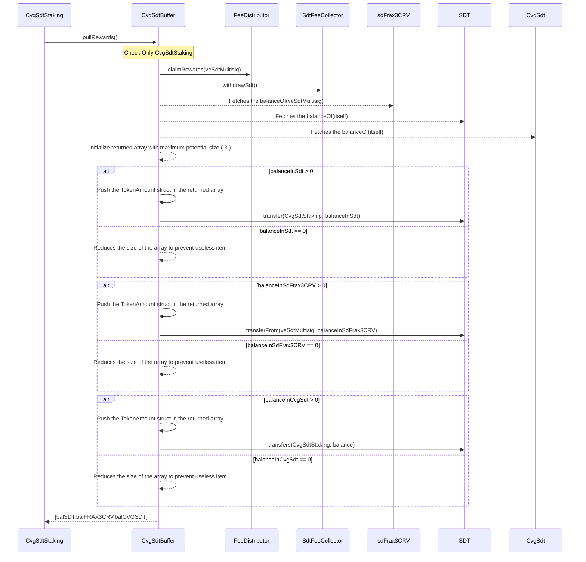

# CvgSdtBuffer

This contract is paired to the `SdtStakingService` having $CvgSdt as stakingAsset. It acts as the `SdtBuffer` and accumulates the rewards to be distributed to stakers.

We couldn't use a classic `SdtBuffer` because it doesn't have the same reward flux as other `SdtStakingService`. It receives always :

- sdFrax3CRV : Coming from the `FeeDistributor` of **StakeDao**
- SDT : Coming from our `SdtFeeCollector`, fees collected on other `SdtStakingService`

Then, potentially :

- SDT or CvgSdt : Coming from our `veSDTMultisig` from bribe rewards or from our `PodMultisig` as a boost.

## pullRewards

Function called during the _processSdtRewards_ on the `SdtStakingService` of CvgSdt.

- Claim rewards in sdFrax3CRV from **StakeDao** `FeeDistributor`.
- Withdraw rewards in SDT from our `SdtFeeCollecor`
- Fetches balance of all SDT and CvgSdt on the contract and send them to the `SdtStakingService`
- Fetches balance of SdFrax3CRV on the `veSdtMultisig` and send them to the `SdtStakingService`. The veSdtMultisig is approving this contract to spend it's sdFrax3CRV.
- Returns an array of pair token/amount distributed in order to store and associate it to a _cvgCycle_ in the `SdtStakingService`.

Note : Any SDT, CvgSdt or sdFrax3CRV sendt directly to this contract will be distributed on the next distribution of rewards on the `SdtStakingService` of CvgSdt.

