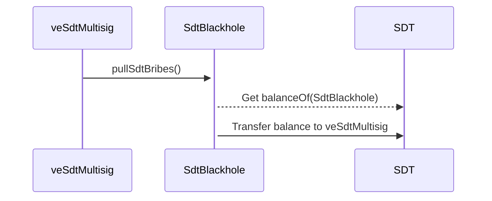
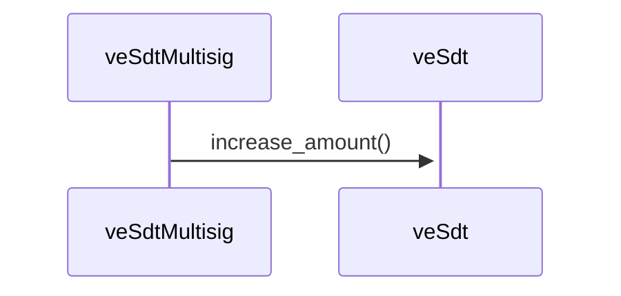
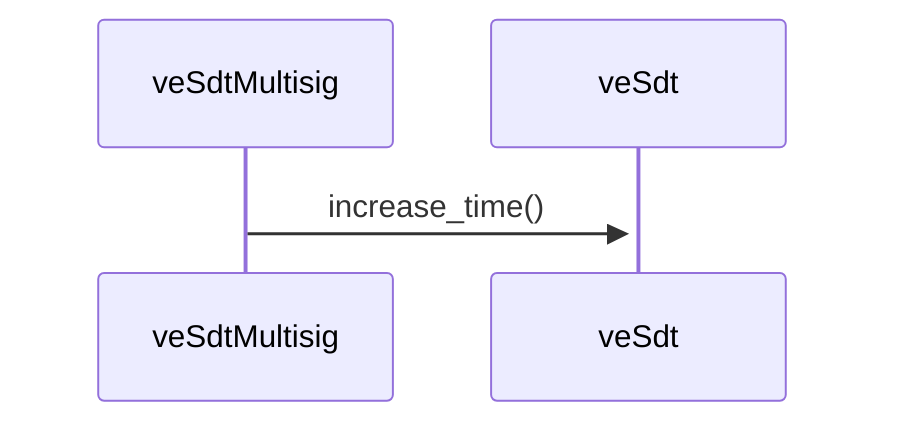
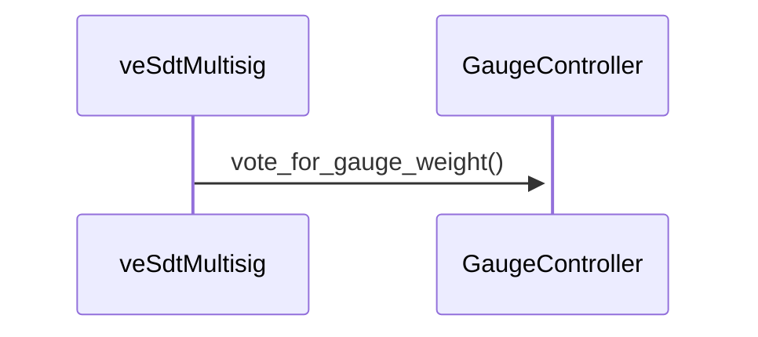
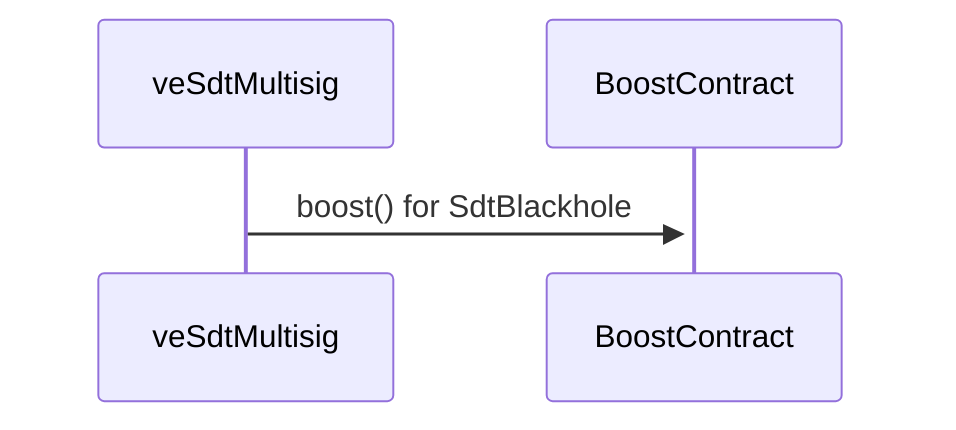

# veSdtBlackHole - Multisig

This contract is a veSdtMultisig:

- receives $SDT converted in exchange of $CvgSdt
- receives $FRAX-3CRV from the `FeeDistributor`
- Lock $SDT to MAX_TIME, hold veSdt
- Must Delegate it's boost to `SdtBlackhole`
- Can vote on Stake Dao `GaugeController`
- Can vote on Stake Dao Snapshots Governance
- Can propose a new gauge addition

Notes : This contract must be whitelisted by the `veSdt` to be able to Lock.

## Distribute rewards to CvgSdtStaking => DOC A JOUR ???

## Increase lock Amount

As the veSdtMultisig, I can increase the lock_amount in `veSdt` with all token coming from the conversion of CvgSdt.

## Increase lock Time

As the veSdtMultisig, I can increase the duration of my lock in `veSdt` to the MAX_DURATION

## Votes on Gauge Controller

As the veSdtMultisig, I can trigger a vote on the `GaugeController` of Stake DAO.

## Boost SdtBlackhole

As the veSdtMultisig, I can boost the revenues of `SdtBlackhole` by calling the boost contract

