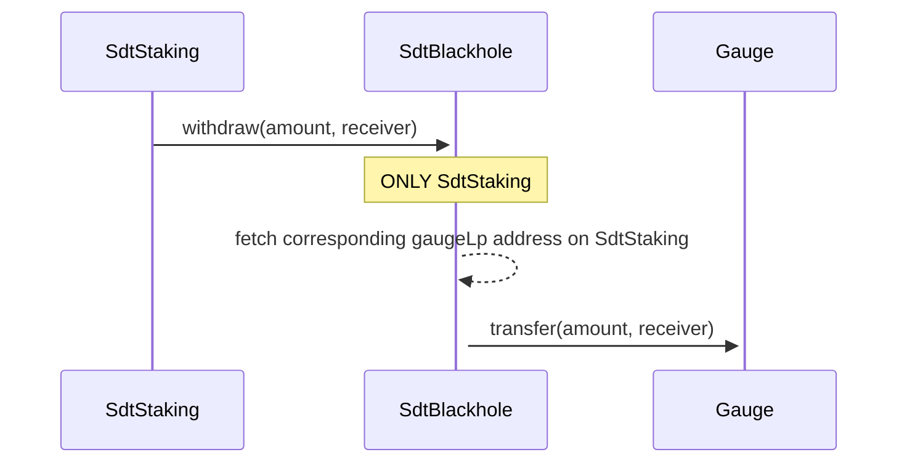
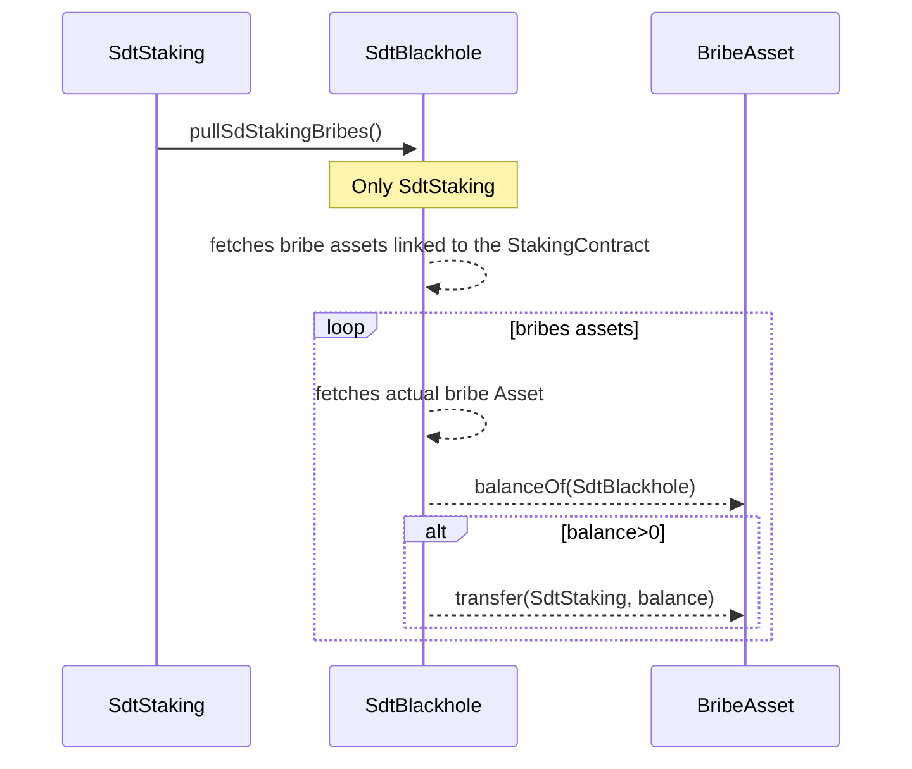
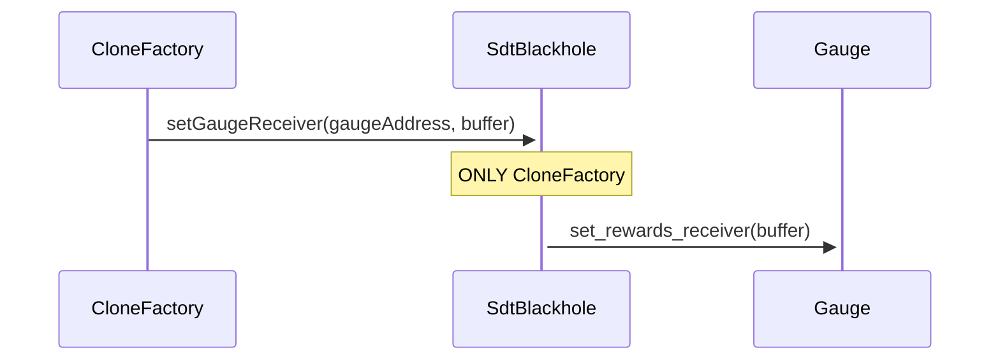
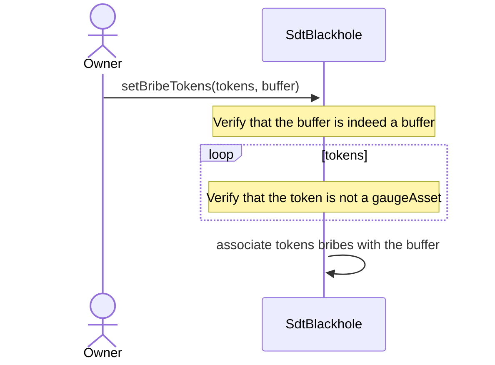
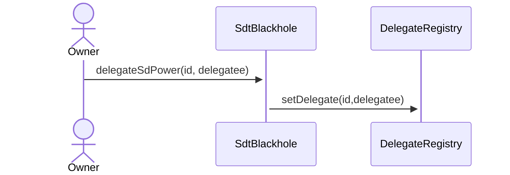

# SdtBlackHole

The motivation behind this contract is to distribute earnings of the **SDT** token among gaugeAsset stakers (all staking contracts except CvgSdtStaking).

On StakeDao, stakers stake their gauge assets to earn rewards in SDT and tokens from the underlying protocols (e.g., Curve, Balancer, Angle ...).

The SDT portion of these rewards can be boosted if the owner of the gaugeAsset has some veSDT or if it has some veSDT delegated from another user/contract. In our case, we consolidate all the gaugeAssets of our users in the `SdtBlackHole`.

To boost SDT earnings, we are delegating the boost from another wallet that accumulates **veSDT** to maximize the rewards.

- Passively receives all $gaugesAssets from `SdtStakings` on deposits for SDT boost distribution.
- Transfers all $gaugesAssets for `SdtStakings` on withdrawal when a user wants their assets back.
- Receives and transfers **sdBribes** from `MultiMerkleStash` contract of **StakeDao** to the corresponding `SdtBuffer`
- Receives `veSdtMultisig` boost in **veSDT** for enhancing staking earnings in SDT

## withdraw

`SdtStaking` can withdraw $gaugeLp tokens matching the $gaugeAsset staked, transferring funds back to the user.

## pullSdStakingBribes

During the processSdtRewards on `SdtStaking`, it is calling the _pullSdStakingBribes_. This function transfers to the `SdtStaking` all corresponding bribe tokens of the `SdtBlackhole`.

## setGaugeReceiver

Each owner of $GaugeAssets from **StakeDao** is set as the default receiver of the ERC20 gauge rewards. This receiver can be changed by calling the _set_rewards_receiver_ on the `Gauge` contract.

In our case, the $gaugeAssets owner is the `SdtBlackhole`. Therefore, it needs to call the _set_rewards_receiver_ function with the corresponding `SdtBuffer` as a parameter for each gauges. This way, every time ANYONE calls the **claim** function on the Stake Dao `Gauge`, the `SdtBuffer` will receive the rewards.

This function can only be called by the `CloneFactory` when creating each pair of `SdtStakingService` and `SdtBuffer`.

## setBribeTokens

Each `SdtStakingService` is eligible to receive bribe rewards. These rewards are claimable by any owner of $sdGaugeAssets (sdCrv, sdBal, sdFxs ...) when the underlying voting power is delegated to **StakeDao**.

Bribe rewards are generally in corresponding $sdAsset. For more flexibility, we added the possibility to customize these rewards by passing an array of token as parameters to _setBribeTokens_.

The owner must ensure that a bribe reward is not already associated with another buffer, otherwise the first buffer to call _pullSdStakingBribes_ will receive all rewards in that token.

## delegateSdPower

To receive bribes from **StakeDao** on contracts with $sdGaugeAsset as the underlying asset, we need to delegate the voting power contained in the $sdGaugeAssets to **StakeDao** by delegating the right namespace _id_ to the right address _delegatee_.

