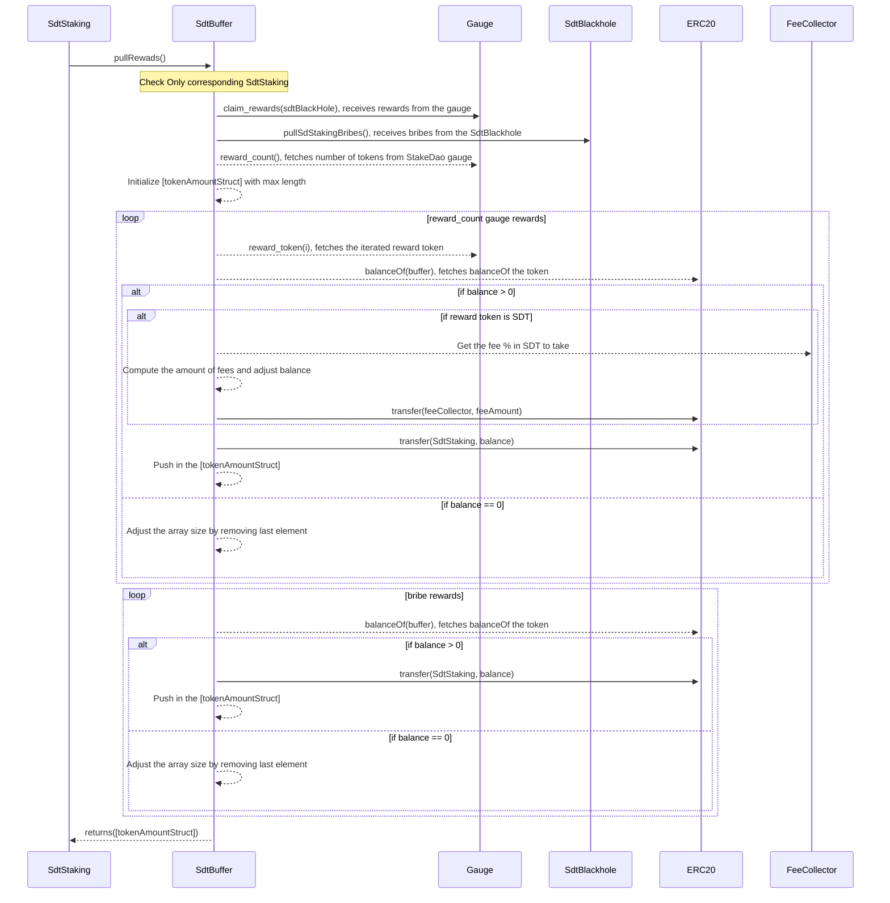

# SdtBuffer

This contract can only be deployed through the _createSdtStakingAndBuffer_ function on the `CloneFactory` contract following the **Beacon proxy** pattern. It is always created in pairs with a `SdtStakingService`.

The role of the `SdtBuffer` is to accumulate :

- Rewards from the **StakeDao** `Gauge`.
- Bribes from the `SdtBlackhole`.

After each processed _cvgCycle_, it is possible to pull the rewards from this contract and send them to the paired `SdtStakingService`, associated with the previous _cvgCycle_.

## Pull Rewards

This function is only callable by the paired `SdtStaking`. It is initially triggered by the _processSdtRewards_ function. It first claims rewards not previously claimed from the **StakeDao** `Gauge` contract and $sdToken bribes.

Then, the entire balance of itself for each token is sent to the paired `SdtStakingService`.
It returns an array containing a struct of tokenAddress and the distributed amount. This array is then stored and associated to the previous _cvgCycle_ in the `SdtStakingService`.

Note : A fee only for SDT is taken before sending the balance to the `SdtStakingService`. This fee is sent to the `FeeCollector` and will be split between the staking contract of $CvgSdt and the POD treasury.

