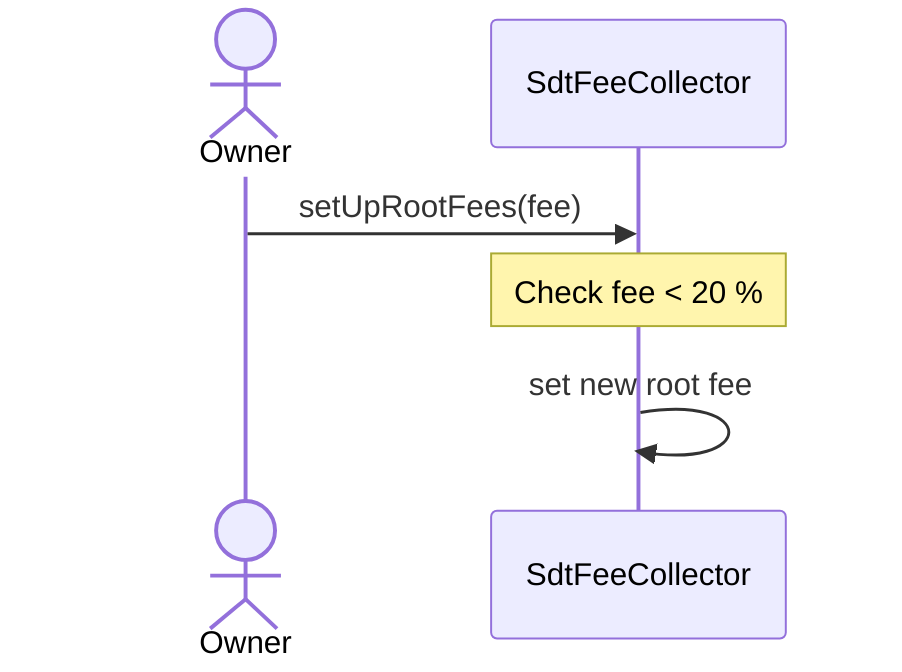
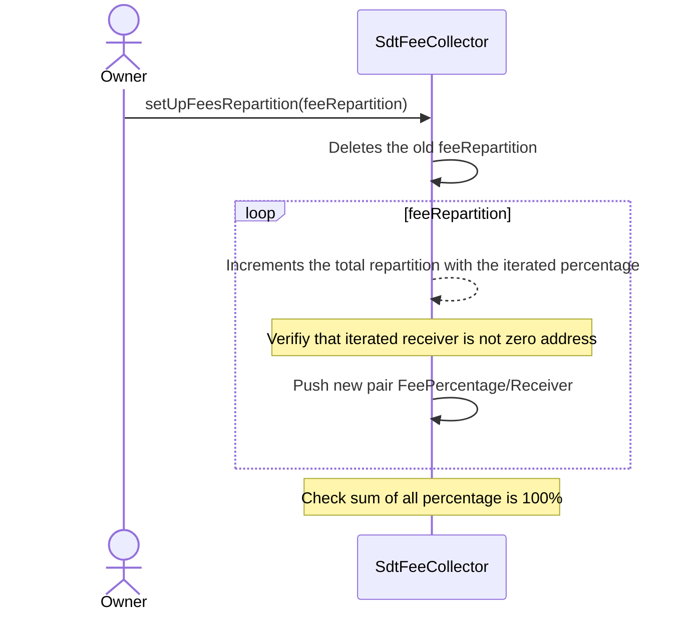
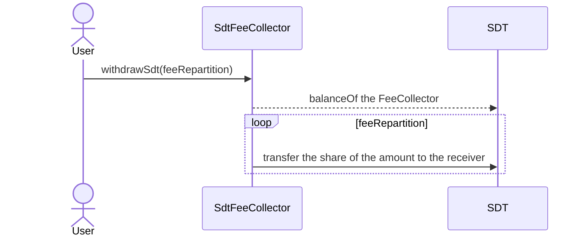

# SdtFeeCollector

This contract receives $SDT from each `SdtBuffer` when the function _pullRewards_ is triggered. This fee is taken based on the param **rootFees**, that cannot exceeds 20%.

Fees accumulates until the _withdrawSdt_ function is called. This call shares out to all differents receivers setup in the array **feesRepartition**.

## setupRootFees

Updates as the owner the fee in SDT in each `SdtBuffer`. Up to 20% fee.

## setUpFeesRepartition

Updates the fee repartition used in the _withdrawSdt_ function.
It sets up an array with a percentage associated to a receiver.
The sum of all percentages has to be equal to 100%.

## withdrawSdt

Disperse the SDT between all the fees receivers following the ratio defined. This function is callable by anyone and is systematically called by the `CvgSdtBuffer` to ensure the distribution is done.

