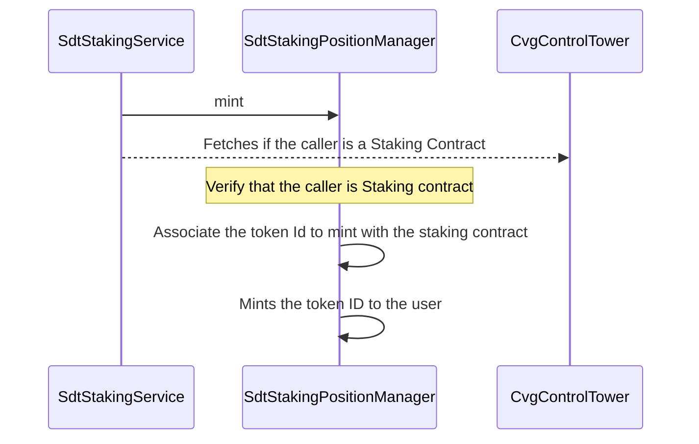
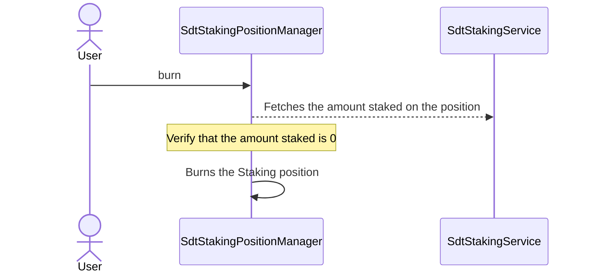

# SdtStakingPositionManager

This contract is a `CvgERC721TimeLockingUpgradeable` contract.

The first motivation of this contract is to externalize the NFT logic from the `SdtStakingService` in order to get space in the size of the contract :

- Tokenize a Staking Position through a transferable NFT.
- All minted positions are linked to a `SdtStakingService`.

## mint

- Mints a Staking Position to the Staking depositor
- This function is only callable by a `StakingService` contract during the _deposit_.

## burn

- Burn the staking position only if the staked amount is equal to 0.

