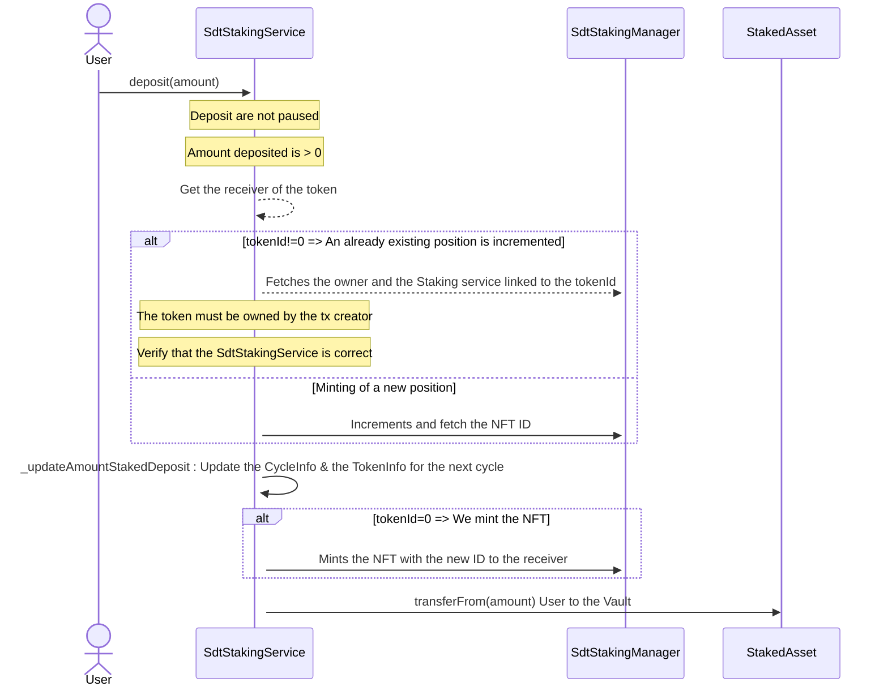
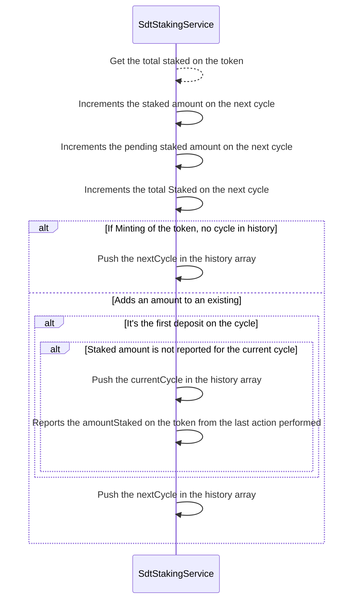
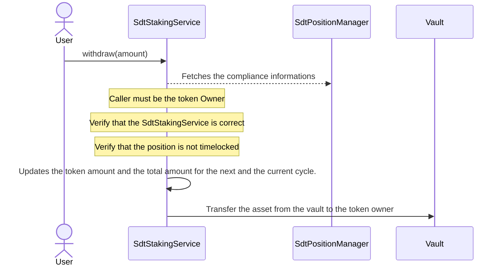
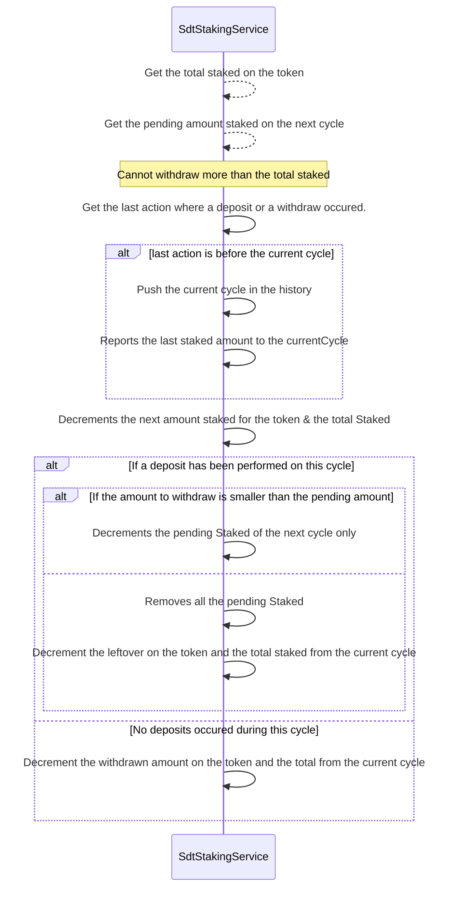
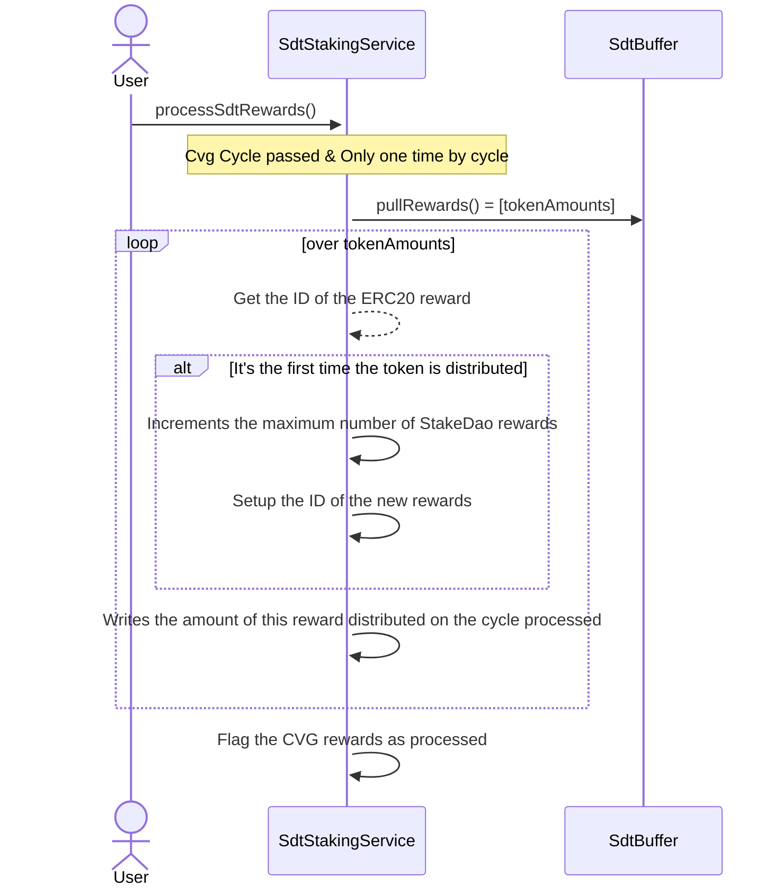
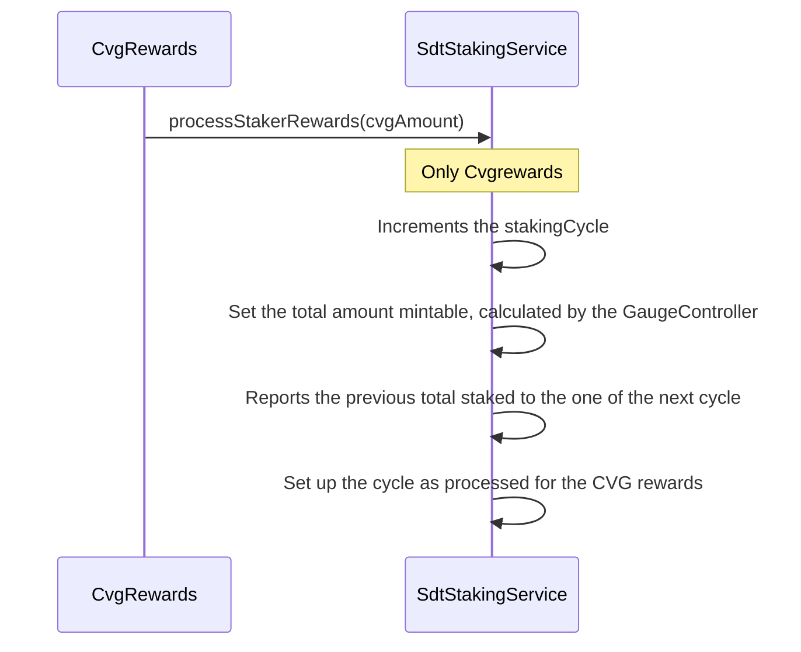
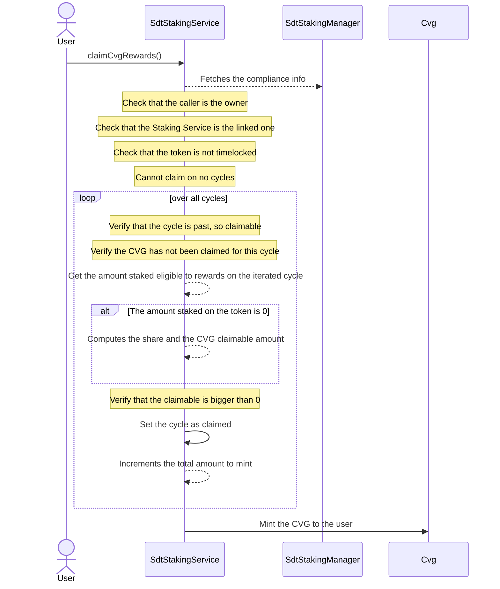
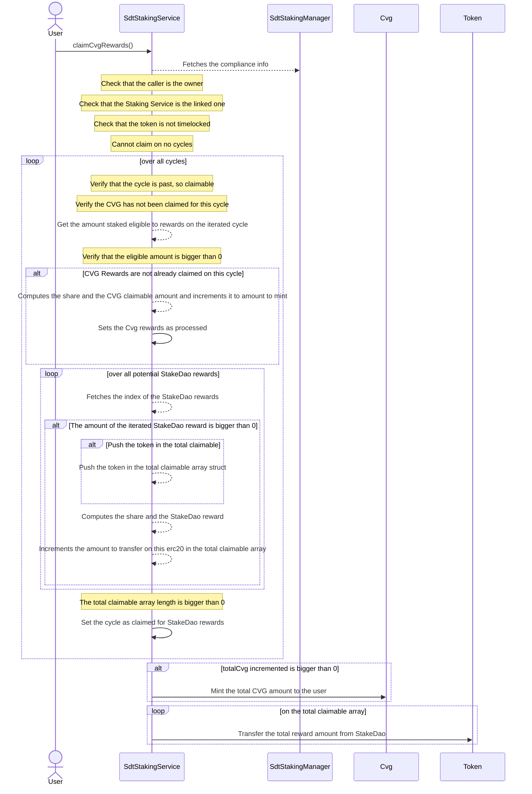

# SdtStakingPositionService

- Register Deposit/Withdraw of all staking positions.
- Eligible staked rewards are staked for at least one entire cycle. Withdrawn rewards are always the most recent ones.
- Is registered as a gauge in the CVG `GaugeController`, so receives $CVG inflation by `CvgRewards`.
- Can pull rewards from its paired `SdtBuffer`, these rewards come from **StakeDao** gauges.
- Can pull $sdAsset bribes from the `SdtBlackhole` ( corresponding to the underlaying $sdAsset ).

### Usecase example :

- **Cycle N**
  - Stakes 100 stakingAsset
- **Cycle N+1**
  - No reward as the 100 staked are still in pending
  - Stake 50 stakingAsset
  - Unstakes 25 stakingAsset
- **Cycle N+2**
  - Rewards for 100 are claimable, 25 stakingAsset are in pending
  - Unstakes 75 stakingAsset
- **Cycle N+3**
  - Rewards for 50 stakingAsset are still claimable

### Note :

Votes must be disabled during the first cycle of deployment to prevent the burning of inflation as 0 token will be staked fully during 1 cycle on the first cycle. Also, processing SDT rewards is not enabled at the first cvgCycle of the deployment.

## deposit

- Issues an NFT **Staking Position** or increase the staked amount on an already existing one.
- Transfer $gaugeAsset from **StakeDao** to the associated **vault**.
- User needs to approve the $gaugeAsset to the `SdtStakingService`
- Staking at cycle N implies that first rewards for these staked asset will be claimable at the beginning of cycle N+2, then every cycle.
- Users can call this function from the `SdtUtilities` to **Convert and Stake** their assets directly.

## \_updateAmountStakedDeposit

- Increments the total amount staked for the next cycle because those tokens will be eligible to rewards only when staked for a full cycle.
- Increments the amount staked for the staking position on the next cycle.
- Increments the pending amount which is usefull to determine which staked amount is eligibile to rewards or not.  
  the last sentence doesn't seem really clear to me,

## Withdraw

- Withdraw stakingAsset (sdAsset-gauge or CvgSdt) from the vault to the Staking Position owner.
- Removing rewards before the end of a cycle leads to the loss of all rewards accumulated during this cycle.
- Withdrawing always removes first from the staked asset deposited on the same cycle ( pending staked ) then on the staked amount eligible to rewards ( on the current cycle).
- If the Staking Position is timelocked, revert withdrawal.

## \_updateAmountStakedWithdraw

- Increments the total amount staked for the next cycle because those tokens will be eligible to rewards only when staked for a full cycle.
- Decrements the total and token amount staked on the next cycle.
- If the next cycle has some pending amount, we remove it first before removing the amount Staked from the currentCycle.

## processSdtRewards

This function is callable one time per cycle. The distribution for one cycle must be performed after the $CVG rewards process on each `SdtStakingService` contract.
Anyone can call this function to execute the SDT rewards process.

When called it'll :

- **claim_rewards()** on the Stake DAO `Gauge`. This will push the rewards from the Gauge to the corresponding `SdtBuffer`.
- **pullRewards()** on the `SdtBuffer`. This transfers the `SdtBuffer` balance of all rewarded tokens to the `SdtStakingService`. ( Note : All gauges reward $SDT, for SDT only, we are transferring some fees to the `CvgBondTreasury` and `CvgSdtBuffer`). This function needs to return an array of amount.
- **pullSdBribes** on the `SdtBlackhole`. This transfer the balance in the corresponding $sdToken or $Token (ex : $sdCRV or $CRV ) regarding the peg on StakeDao side. We need to identify which type of token is rewarded in the return of the function.

The last step of the function is to writes the amount array (merge amounts coming from `SdtBlackhole` if needed) of all token rewarded in the `SdtStakingService`. For instance, for the sdScrv => [sdtAmount, crvAmount, 3crvAmount, sdCrv]

## processStakersRewards

- Called during the paginated process in `CvgRewards` process.
- Writes in the `SdtStakingService` the amount of $CVG that will be minted for all stakers for the cycle processed.

## claimCvgRewards

- Callable when the distribution of `CvgRewards` through processStakerRewards is done on `CvgSdtStaking`
- $CVG is claimable by cvgCycle

## claimCvgSdtRewards

- Callable when the distribution of `CvgSdtBlackHole` through processSdtRewards is done on `CvgSdtStaking`
- $FRAX-3CRV AND ($SDT OR $CvgSdt) are claimable by cvgCycle
- Need to be able to support a new rewarded token

