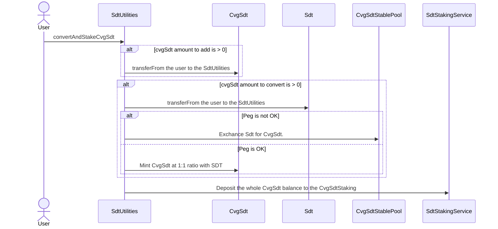
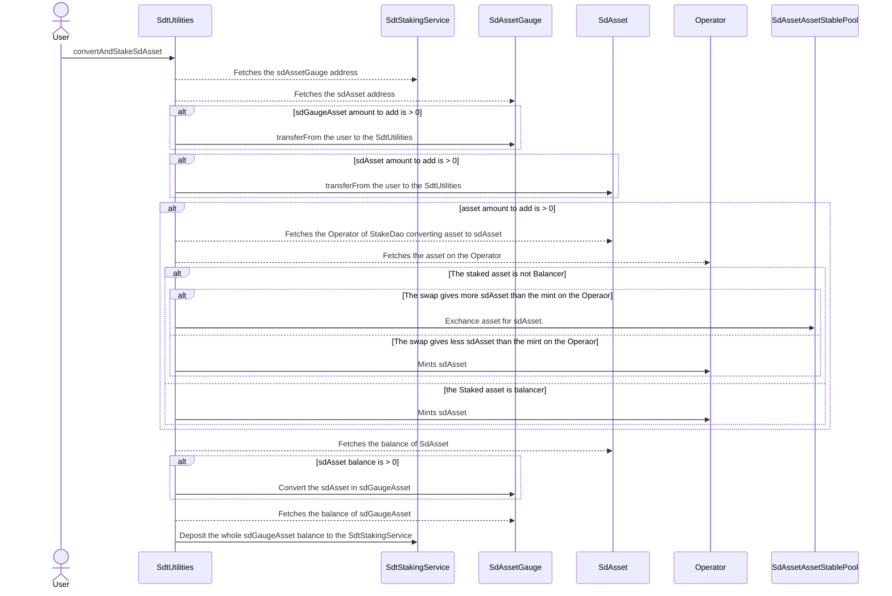
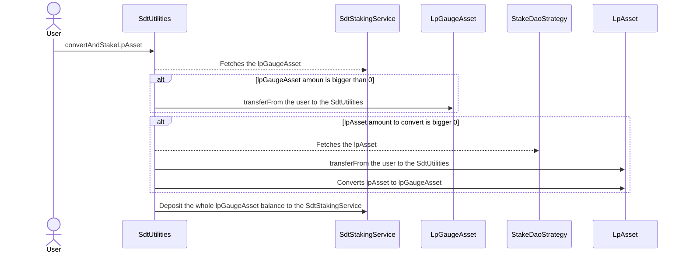
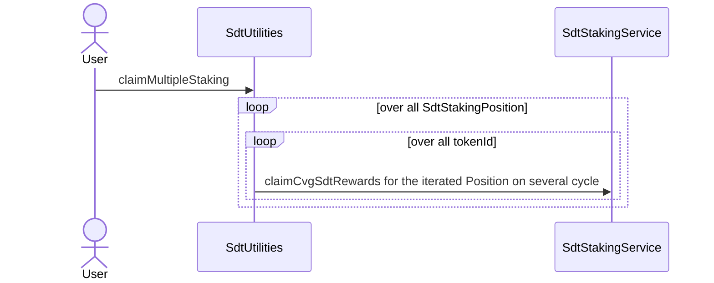

# SdtUtilities

The `SdtUtilities` aims to enhance the user experience of Convergence users. It can :

- For sdAsset staking, convert the source asset ( CRV, ANGLE, FXN ...) to the $sdGaugeAsset and stake it into **Convergence**.
- For lpAsset staking, convert the lpAsset to the $lpGaugeAsset and stake it into **Convergence**.
- For CvgSdt staking, convert the SDT to CvgSdt and stake it into **Convergence**.
- Allows to claim on different `SdtStakingService` on several positions in one tx.

### Usecase example :

A user has $CRV and wants to stake them in Convergence. Normally, he'd have to :

- Approve the $CRV to the `Depositor` of **StakeDao**
- Deposit its $CRV in exchange of $sdCRV
- Approve the $sdCRV to the `Gauge` of **StakeDao**
- Deposit its $sdCRV into the `Gauge`, receiving $sdGaugeCRV
- Approve the $sdGaugeCRV to the `SdtStakingService` of Converge
- Deposit the $sdGaugeCRV into the `SdtStakingService`.

With the `SdtUtilities`, the user only needs to :  

- Approve its $CRV to be spent by the `SdtUtilities`
- Convert its $CRV in $sdGaugeCRV & Stake the $sdGaugeCRV in the `SdtStakingService` (one tx)

The `SdtUtilities` handles all conversions to the stakedAsset that we accept in Convergence. 

### Note :

`SdtUtilities` must approve all contracts converting the assets or the convert functions will not work.

## convertAndStakeCvgSdt

- Converts SDT to CvgSdt and stake all the CvgSdt into a new or an already existing staking position.  
- The user can add an initial amount of CvgSdt that will be added to the converted amount from SDT.
- The convert is regarding the peg of CvgSdt either :
  - A mint through the `CvgSdt` at the ratio 1:1 if the peg is OK.
  - A Swap in the **CvgSdt/Sdt** stable pool, if the peg is not OK.

## convertAndStakeSdAsset

- Converts $asset and/or $sdAsset to $sdAssetGauge and stakes all the converted in $sdAssetGauge to the corresponding `SdtStakingService`.
- The user can transfer an amount of $asset that will be converted to $sdAsset.
- The user can transfer an amount of $sdAsset that will be converted to $sdAssetGauge.
  and $sdAsset.
- The user can add an initial amount of $sdAssetGauge that will be added to the converted amount from $asset & $sdAsset.
- The isLock parameter locks all of the amount of Asset on **StakeDao** side. Enabling isLock will get all fees accumulated to cover the price of the locking transaction ( This is costly ). When isLock is set at false, it is taking a fee in asset.

## convertAndStakeLpAsset

- Converts $lpAsset to $lpAssetGauge and stakes all the converted in $lpAssetGauge to the corresponding `SdtStakingService`.
- The user can transfer an amount of $lpAsset that will be converted to $lpGaugeAsset.
- The user can add an initial amount of $lpGaugeAsset that will be added to the converted amount from $lpAsset.
- The isEarn parameter streams the rewards of the underlying strategy on **StakeDao** side. Enabling isEarn will get all fees accumulated from previous depsoit in the strategie ( This is costly ). When isEarn is set at false, it is taking a fee in asset.

## claimMultipleStaking

- Allows a Staking position owner to claim on different positions from different `SdtStakingService`. 
- Enables the `Claim All` functionnality on the Dapp.
- The user can choose to Convert all his SDT to CvgSDT

