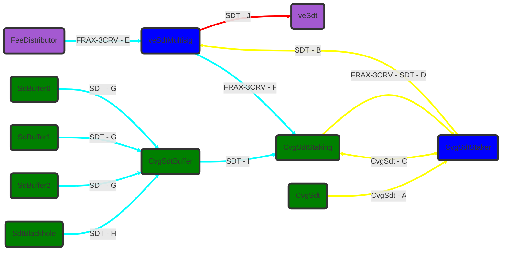
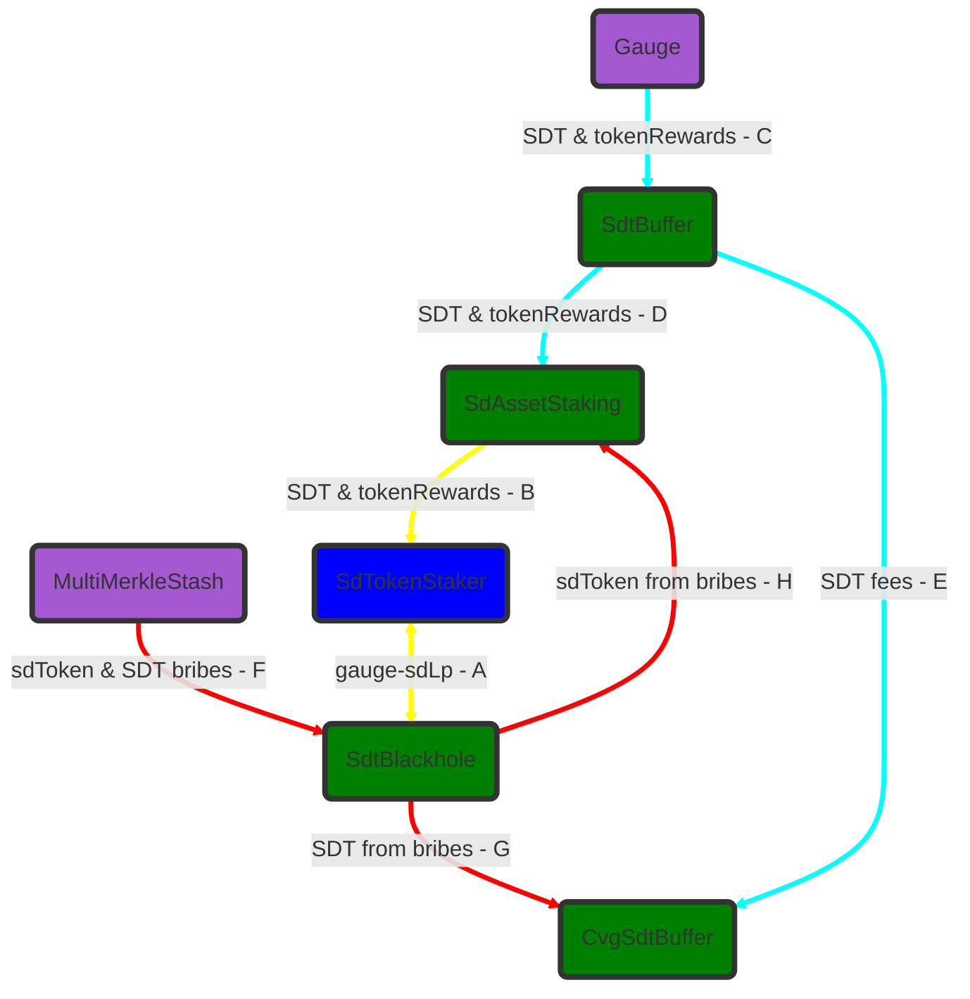

# ERC20 Flux CvgSdtStaking

- **Yellow** : User Flux
- **Cyan** : Rewards Flux
- **Red** : Locking Flux

## User flux

- A : As a $SDT owner, I can mint some $CvgSdt in exchange of $SDT.
  - Transfer triggered by mint on `CvgSdt`
- B : As a $SDT owner, I send the $SDT coming from the conversion to the `veSdtMultisig`.
  - Transfer triggered by mint on `CvgSdt`
- C : As a $CvgSdt owner or a staking position owner, I can deposit & withdraw my $CvgSdt to the `CvgSdtStaking` contract
  - Transfer triggered by deposit/withdraw on `CvgSdtSdtStaking`
- D : As a staking position owner, I can claim my rewards relative in $SDT and $FRAX-3CRV & more
  - Transfer triggered by claimSdtRewards on `CvgSdtSdtStaking`

## Rewards flux

- E : Anyone can claim rewards in $FRAX-3CRV on the `veSdtMultisig`
  - Transfer triggered by claim from `FeeDistributor`
- F : As the Musltisig, I can trigger on the `CvgSdtBuffer` the distribution process for `CvgSdtStaking`, and so transferFrom the $FRAX-3CRV of `veSdtMultisig` on `CvgSdtStaking`.
  - Transfer triggered by processRewards from `CvgSdtBuffer`
- G : Passively receiving $SDT from the fees on the processSdtRewards of `SdAssetStaking`
  - Transfer triggered by the pullRewards on `SdtBuffer`
- H : As the `CvgSdtBuffer`, I can pull $SDT bribes from the `SdtBlackhole`
  - Transfer triggered by pullSdtBribes on `SdtBlackhole`
- I : As the `CvgSdtBuffer`, I can transfer the $SDT fees & bribes to the `CvgSdtStaking`
  - Transfer triggered by sendRewards on `CvgSdtBuffer`

## Lock flux

- J : As the `veSdtMultisig`, I can lock the $SDT in the `veSdt`
  - Transfer triggered by increase_lock_amount on `veSdt`

# ERC20 Flux SdAssetStaking

- **Yellow** : User Flux
- **Cyan** : Rewards Flux
- **Red** : Bribes Flux

## User flux

- A : As a $gaugeLP owner or a staking position owner, I can deposit & withdraw my $gaugeLP in the `SdtBlackhole`.
  - Transfer triggered by deposit/withdraw on `SdAssetStakingContract`
- B : As the `SdtBlackhole`, each time I receive sdToken from (A) I deposit / withdraw the $sdToken in the Gauge related.
  - Transfer triggered by deposit/withdraw on StakeDao `Gauge`

## Rewards flux

- C : Anyone can trigger the rewards claiming on a gauge for a `SdtBuffer` in $SDT and other gauge rewards.
  - Transfer triggered by claim_rewards on a`Gauge`
- D : During the process SDT rewards, if all conditions are met, transfer gauges rewards from the `SdtBuffer` to it's `SdAssetStaking`.
  - Transfer triggered by pullRewards `SdtBuffer`
- E : During the process SDT rewards, if all conditions are met, transfer fees of gauges rewards in $SDT from the `SdtBuffer` to the `CvgDistributor`
  - Transfer triggered by pullRewards `SdtBuffer`

## Bribes flux

- F : Anyone, can claim rewards earned thorugh bribing in $SDT, $sdAsset & $asset. Thoose rewards are accumulated in the `SdtBlackhole`.
  - Transfer triggered by claimRewards on `MultiMerkleStash`
- G : Anyone, can transfer $SDT to `CvgDistributor`.
  - ERC20 Transfer
- H : Anyone, can transfer $CVGSDT to `CvgDistributor`.
  - ERC20 Transfer
- I : During the processSdtRewards of each `SdAssetStaking`, $sdAsset & or $asset are pulled from the `SdtBlackhole` to the `SdAssetStaking`.
  - Transfer triggered by pullSdBribes on `SdtBlackhole`

# Contract example

| Contract         | Example                                                                 |
| ---------------- | ----------------------------------------------------------------------- |
| Gauge            | https://etherscan.io/address/0x7f50786A0b15723D741727882ee99a0BF34e3466 |
| FeeDistributor   | https://etherscan.io/address/0x29f3dd38dB24d3935CF1bf841e6b2B461A3E5D92 |
| veSDT            | https://etherscan.io/address/0x0C30476f66034E11782938DF8e4384970B6c9e8a |
| MultiMerkleStash | https://etherscan.io/address/0x03e34b085c52985f6a5d27243f20c84bddc01db4 |
| DelegateRegistry | https://etherscan.io/address/0x469788fE6E9E9681C6ebF3bF78e7Fd26Fc015446 |
